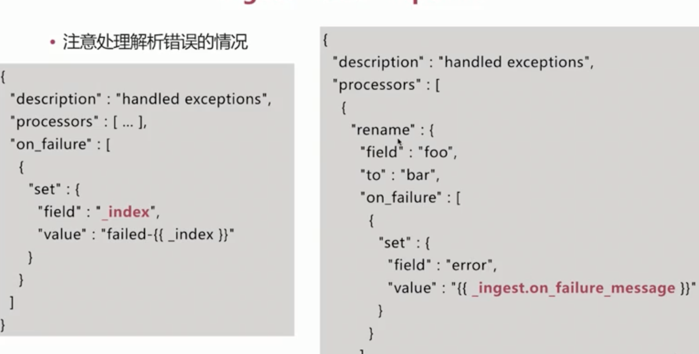

# Beats篇

> 
>
> - 一个轻量级的收集数据
>
> ## 架构
>
> 

## FileBeat

- filebeat 运行

- 

- 读取日志文件,但不做数据的`解析`处理

- 保证日志`至少被读一次`,即数据不会丢失

- 其他能力

  - 处理多行数据
  - 解析`json`格式数据
  - 简单的过滤功能

- 

  > `使用`
  >
  > - 配置`filebeat.yml`
  > - 配置模板`index template`
  > - 配置 `kibana dashboards`
  > - 运行
  >
  > 
  >
  > `配置模板`
  >
  > 
  >
  > 

  `架构一`

  

  `架构二`

  

-  5.x新增了一个节点类型

  - 在数据写入`es` 前(`_bulk\index操作`)对数据进行处理
  - 可设置独立的`ingest node`专门进行数据转换处理`node.ingest:true`
  - `api endpoint`为`pipline`
    - `pipeline`由一系列的`processor`组成,类似`logstash`中的`filter plugin`
    - 
    - `pipline`API主要有下面几个
      - 创建`put`
      - 获取`get`
      - 删除`delete`
      - 模拟调试`simulate`
    - 
    - 

- `PROCESSOR处理`

  - 

- 处理`解析错误`的情况

  - 

- 

