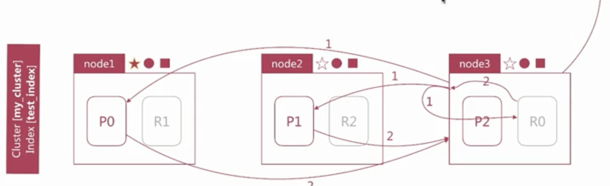

# kedacom 部署组 - elasticsearch 开发文档

> - Document 文档
>   - 用户存储在es中的文档数据
> - 索引Index
>   - 类比mysql中的table --------------  6.0 不允许建多个type
> - 节点Node         ------------------------ 集群的节点单元
>   - es的运行实例
> - 集群cluster
>   - 对外提供实例

### `常用的交互方式`

> - kibanna
>
> 

### elasticsearch基本知识

#### document

```yaml
- JSON OBJECT 由字段(field)组成
	常见数据类型: text,keyword
	数值型: long,short,byte...
	布尔: Boolean
	日期: date
	二进制: binary
	范围类型: integer_range,float_range,long_range...
	
-  元数据,用于标注文档的相关信息
	_index: 文档所在的索引名
	_type: 文档所在的类型名
	_id: 文档唯一id
	_uid: 组合id,由_type和_id组成(6.x_type不在起作用,通_id一样)
	_source: 文档的原始json数据,可以获取每个字段的内容
	_all: 整合所有字段内容到该字段,默认禁用(不推荐使用)

```


#### 创建一个索引

> ##### 创建索引  PUT /test_index
>
> 
>
> ##### 删除索引  DELETE /test_index
>
> 
>
> 

#### 新建文档

> ##### 新建文档 指定id创建
>
> PUT /test_index/_doc/1
> {
>   "username":"alfred",
>   "age":1
> }
>
> 
>
> ##### 不指定id创建
>
> PUT /text_index/_doc/
> {
>   "username": "alfred",
>   "age": 1
> }
>
> 
>
> 


#### 查询文档

> ##### 查找指定id的文档  **方法**1
>
> - id存在
>   - GET /test_index/doc/1
>   - 
> - id不存在
>   - GET /test_index/doc/4
>   - 
>
> ##### 查询文档文档api  方法2
>
> GET /test_index/doc/_search
> {
>   "query":{
>     "term": {
>       "_id": 1
>     }
>   }
> }
>
> 
>
> GET /test_index/doc/_search  # 获取所有
>
> 

#### 批量创建文档

> ##### `批量创建写入`
>
> - 批量写入操作
>   - index  `新建文档`
>   - update  `修改文档`  格式{update:{文档信息}}  后面跟 {文档}
>   - delete   `删除文档`
>
> POST /customer/external/_bulk
> {"index":{"_id":"1"}}
> {"name": "John Doe" }
> {"index":{"_id":"2"}}
> {"name": "Jane Doe" }
>
> 
>
> ##### 批量查询
>
> POST /customer/external/_mget    在下面docs中填写查询条件
> {
>   "docs": [
>     {
>       "_id": 1
>     },
>     {
>       "_id": 2
>     }
>   ]
> }
>
> 

### 倒排索引和分词

- 正排索引 -------------------------------例  `书的目录`

  - 正排表是以文档的ID为关键字，表中记录文档中每个字的位置信息，查找时扫描表中每个文档中字的信息直到找出所有包含查询关键字的文档。

  

- 倒排索引 -------------------------------例   `书的索引页`

  - 倒排表以字或词为关键字进行索引，表中关键字所对应的记录表项记录了出现这个字或词的所有文档，一个表项就是一个字表段，它记录该文档的ID和字符在该文档中出现的位置情况。


> ##### `倒排列表`
>
> - 记录单词对应的文档集合,由倒排缩影posting组成
> - 倒排所影响破损厅主要包括如下信息
>   - `文档ID(doc id)`,用于获取`原始信息`
>   - `单词频率(term frequencies)`,记录单词在该文档`出现次数`,用于后续`相关性算分`
>   - `位置(position)`,记录单词在文档中的`分词位置(多个)`,用于做`词语搜索`
>   - `偏移(offsets)`,记录单词在文档中的`开始`和`结束`位置

#### 分词

------

##### 概念

分词描述

> `- Character Filter` ------- 文本过滤
>
> - 针对原始文本进行处理,`比如去除html特殊标记符`
>
> `- Tokenizer` ------- 标记生成器
>
> - 将原始文本按照规则切分为单词
>
> `- Token Filter` -------  令牌过滤器
>
> - 正对tokenizer处理的单词进行再加工,比如`转小写`,`删除`或`新增等处理

分词analyzer api   -----> `分析`

- `es`自带分词器
  - `Standard`
  - `Simple`
  - `Whitespace`
  - `Stop`
  - `Keyword`
  - `Pattern`
  - `Language`

> - 直接指定analyzer
>
> - > `GET _analyze`
>   > {
>   >   "analyzer": "standard",
>   >   "text":"hello world"
>   > }
>   >
>   > 
>
> - 直接指定索引的字段进行测试,接口如下
>
>   - >`POST text_index/_analyze`
>     >{
>     >  "field": "username",
>     >  "text":"hello world"
>     >}
>     >
>     >没指定分词器--------> 默认会使用"analyzer": "standard"分词器
>
> - 自定义分词器
>
>   - > `POST _analyze`
>     > {
>     >   "tokenizer": "standard",
>     >   "filter": ["lowercase"],
>     >   "text":"hello world"
>     > }
>     >
>     > 

##### `默认分词器`

> `standard`
>
> - `默认分词器`
> - `按词分割`
> - `支持多语言`
> - `小写处理`
> - `POST _analyze`
>   {
>     "analyzer": "standard",
>     "text":"The 2 Quick Brown-Foxes jumped over the lazy dog's bone"
>   }
> - [the,2,quick,brown,foxes,jumped,over,the,lazy,dog's,bone]
>
> `simple`
>
> - `按照非字母切分`
> - `小写处理`
> - [the,quick,brown,foxes,jumped,over,the,lazy,dog,s,bone]
>
> `whitespace`
>
> - `按照空格切分`
> - [The,2,Quick,Brown-Foxes,jumpe,over,the,lazy,dog's,bone]
>
> ##### `stop`
>
> - `stop word`指语气助词等修饰性的词语,比如the、an、的、这等等
> - 相比`simple`多了个token filter==>`stop word`等等
> - [quick,brown,foxes,jumped,over,lazy,dog,s,bone]
>
> ##### `keyword`
>
> - 不分词输出,直接`输入`作为`一个单词`输出
>
> ##### `pattern`
>
> - 通过`正则表达式`自定义分隔符
> - 默认是`\w+`,既`非字符符号`作为分隔符
>
> ##### `language`
>
> - 提供了30+创建的语言分词

------

##### 中文分词

- 难点
  - 中文分词指的是将一个汉字序列切分成一个一个单独的词,在英文中,单词之间以空格作为自然分界符,汉语中词没有一个形式上的分界符
  - 上下文不同,分词结果含义不同,比如交叉奇异问题:
    - 兵乓球拍/卖/完了
    - 乒乓球/拍卖/完了
  - 目前主流的中文分词系统 [IK,jieba]   自然语言处理的分词系统[Hanlp,THULAC]

------

##### `自定义分词`

`Characters Filters` ----------> 自定义分词

- 在`Tokennizer`之前对原始文本进行处理,比如增加、删除或替换字符等
- 自带额如下:
  - `HTML Strip`去除html标签和转换的html实体
  - `Mapping`进行字符替换操作
  - `Pattern Replace`进行正则匹配替换
- 会影响position和offset

> `POST _analyze`{
>
>   "tokenizer": "keyword",
>   "char_filter": [
>     "html_strip"
>   ],
>   "text": "<p>I&apos;m so <b>happy</b>!</p>"
> }	

------

`Tokenizer ` ----------> 自定义分词

- 自带分词器
  - `standard` 按照单词进行分隔
  - `letter` 按照字符进行分隔
  - `whitespace` 按照空格进行分隔
  - `UAX` URL Email 按照standard分隔,但不会分隔邮箱和url
  - `NGram` 和 `Edge NGram` 连词分隔 -----------> 智能提示
  - `Path_Hierarchy` 按照文件路径进行切割

> `POST _analyze`
> {
>   "tokenizer": "path_hierarchy",
>   "text":"/one/two/three"
> }

------

`token filter`  ----------> 自定义分词

- 对于tokenizer输出的`单词(term)`进行增加、删除、修改等操作
- 自带如下
  - `lowercase` 将所有`term`转为小写
  - `stop`删除stop words ---> 既 a an the 等
  - `NGram` 和 `Edge NGram` 连词分隔
  - `Synonym` 添加近义词的term

> `POST _analyze`
>
> {
>   "text":"a hello,world!",
>   "tokenizer": "standard",
>   "filter": [
>     "stop",
>     "lowercase",
>     {
>       "type":"ngram",
>       "min_gram":4,
>       "max_gram":4
>     }
>     ]
> }

自定义分词实现

- 自定义分词器

```json
# 定义分词器 -----------------> 单类型
PUT text_index_1
{
  "settings": {      ---------------> #配置
    "analysis": {	 ---------------->  #分词器族
      "analyzer": {  ----------------->  #分词器
        "my_custom_analyer":{  ------------->  #自定义的分词器
          "type":"custom",    ---------------> #类型
          "tokenizer":"standard",
          "char_filter":[
            "html_strip"
          ],
          "filter":[
            "lowercase",
            "asciifolding"
            ]
        }
      }
    }
  }
}
# 使用分词器
POST text_index_1/_analyze
{
  "analyzer": "my_custom_analyer",
  "text":"Is this <b> a box </b>?"
}

#  多类型
PUT text_index_2
{
  "settings": {
    "analysis": {
      "analyzer": {
        "my_custom_analyzer":{
          "type":"custom",
          "char_filter":[
            "emoticons"
            ],
            "tokenizer":"puncation",
            "filter":[
              "lowercase",
              "english_stop"
              ]
        }
      },
      "tokenizer": {
        "puncation":{
          "type":"pattern",
          "pattern":"[.,!?]"
        }
      },
      "char_filter": {
        "emoticons":{
          "type":"mapping",
          "mappings":[
            ":)=>_happpy_",
            ":(=>_sad_"
            ]
        }
      },
      "filter": {
        "english_stop":{
          "type":"stop",
          "stopwords":"_english_"
        }
      }
    }
  }
}

POST text_index_2/_analyze
{
  "analyzer": "my_custom_analyzer",
  "text":"I'm a :) person, and you?"
}
```

------

##### 分词使用的时机

- 索引时分词,通过配置index mapping中的每个字段的`analyzer`实现的,如下
- 不指定分词默认standard

```json
# 搜索时指定分词查询
POST text_index/_search
{
  "query":{
    "match": {
      "message": {
        "query": "hello",
        "analyzer": "standard"
      }
    }
  }
}

# 添加时指定分词查询
PUT text_index
{
  "mappings": {
    "properties": {
      "title":{
        "type": "text",
        "analyzer": "whitespace",
        "search_analyzer": "standard"
      }
    }
  }
}

```

- 明确字段是否需要分词,不需要分词的字段将`type`设置为keyword,可以节省空间和提高写性能
- 可用`_analyze api`查看具体的分词结果测试

------

### Mapping设置

`类似数据库中的表结构定义,主要作用如下`

- 定义`Index`下的字段名(Field Name)
- 定义字段类型,比如数值类型,字符串类型,布尔类型
- 定义倒排索引相关配置,比如是否索引,记录`position`等
- mapping中的字段类型一旦设定后,`禁止`直接修改,原因如下 -------------------  类比mysql表结构
  - lucene实现的倒排索引生成后不允许修改
  - 重新建立新的索引,然后做reindex操作
- 自定义字段
  - 允许新添字段

  - 通过dynamic参数来控制字段新增 ------------------> 更具具体需求选择
    - `true(默认)`  允许新增字段

    - `false`  不允许新增字段,但是文档可以正常写入,但无法对字段进行查询等操作

    - `strict` 文档不许与写入,报错

    - ```json
      # 新增表结构定义
      PUT my_index
      {
        "mappings": {
          "_doc":{
            "dynamic":false,
            "properties":{
              "title":{
                "type":"text"
              },
              "name":{
                "type":"keyword"
              },
              "age":{
                "type":"integer"
              }
            }
          }
        }
      }
      ```


      GET my_index/_mapping
    
      PUT /my_index/_doc/1
      {
        "title":"hello,world",
        "desc":"nothing here"
      }
    
      GET my_index/_doc/_search
      {
        "query":{
          "match":{
            "title":"hello"
          }
        }
      }
    
      GET my_index/_doc/_search
      {
        "query":{
          "match":{
            "strict":"here"
          }
        }
      }
      ```

  - `copy_to`

    - 将该字段的值赋值到目标字段中,实现类似_all的作用

    - 不会出现_source中,只用来搜索

    - ```json
      PUT my_index
      {
        "mappings": {
          "_doc":{
            "properties": {
            "first_name":{
              "type": "text",
              "copy_to": "full_name"
            },
            "last_name":{
              "type": "text",
              "copy_to": "full_name"
            },
            "full_name":{
              "type": "text"
            }
          }
          }
        }
      }

      PUT my_index/_doc/1
      {
        "first_name":"John",
        "last_name":"Smith"
      }

      GET my_index/_search
      {
        "query": {
          "match": {
            "full_name": {
              "query": "John Smith",
              "operator": "and"
            }
          }
        }
      }
      ```

  - `index`

    - 控制当前字段是否索引,默认为true,既记录索引,false不记录,既不可搜索

    - 案例分析---------------需求身份证号等不需要被检索的一些敏感信息

    - ```json
      PUT my_index
      {
        "mappings": {
          "_doc": {
            "properties": {
              "cookies": {
                "type": "text",
                "index": false
              }
            }
          }
        }
      }
      ```


      PUT my_index/_doc/1
      {
        "cookies":"name=alfread"
      }
    
      GET my_index/_search
      {
        "query": {
          "match": {
            "cookies": "name"
          }
        }
      }
      ```

  - `index_options` 用于控制倒排索引记录的内容,有如下4中配置

    - `docs` 只记录 doc id

    - `freqs`记录doc id 和 term frequencies

    - `position`记录doc id、term frequencies 和 term position

    - `offsets` 记录doc id、term frequencies、term position 和character offsets

    - text 类型默认配置`position`,其他默认为`docs`

    - 记录内容越多,占用空间越大

    - ```json
      PUT my_index
      {
        "mappings": {
          "_doc": {
            "properties": {
              "cookies": {
                "type": "text",
                "index_options": "offsets"
              }
            }
          }
        }
      }
      ```

  - `null_value`

    - 当字段遇到null值的水处理策略,默认为null,既控制,此时es会忽略此值,可以通过设定该值设定字段的默认值

    - ```JSON
      PUT my_index
      {
        "mappings": {
          "_doc":{
            "properties":{
              "status_code":{
                "type":"keyword",
                "null_value":"NULL" ---------------------> 默认值
              }
            }
          }
        }
      }

      ```

#### `核心数据类型`

- 字符串类型  --------------------->`text` ,`keyword`
- 数值型        --------------------->`long`,`integer`,`short`,`byte`,`double`,`float`,`half_float`,`scaled_float`
- 日期类型     --------------------->`date`
- 布尔类型     --------------------->`boolean`
- 二进制类型  ---------------------> `binary`
- 范围类型     --------------------->`integer_range`,`float_range`,`long_range`,`double_range`,`date_range`

#### `复杂数据类型`

- 数组类型     --------------------->`array`
- 对象类型     --------------------->`object`
- 嵌套类型     --------------------->`nested object`

#### `地理位置数据类型`

- 地理位置点  --------------------->`geo_point`
- 地理位置形状  ------------------>`geo_shape`

#### `专用类型`

- 记录ip地址`ip`
- 实现自动补全`completion`
- 记录分词数`token_count`
- 记录字符串hash值`murmur3` --------------------> 插件实现
- 增量处理的`percolator`
- 父子查询`join`

#### `多字段特性multi-fields`

- 允许对`同一个字段`采用不同的配置,比如`分词`,常见的例子入对人名实现`拼音搜索`,只需要在人名中新增一个子字段未`pinyin`即可

#### `Dynamic Mapping`

- es可以`自动识别文档字段类型`,从而降低用户使用成本,如下所示

- ```json
  DELETE text_index

  PUT /text_index/_doc/1
  {
    "username":"alfred",
    "age":3
  }

  GET /text_index/_mapping

  {
    "text_index" : {
      "mappings" : {
        "_doc" : {
          "properties" : {
            "age" : {
              "type" : "long"
            },
            "username" : {
              "type" : "text",
              "fields" : {
                "keyword" : {
                  "type" : "keyword",
                  "ignore_above" : 256
                }
              }
            }
          }
        }
      }
    }
  }
  ```

- es依靠`json文档`的字段类型来实现`自动识别字段类型`,支持类型如下

- `es`依靠`JSON`文档的字段类型来实现自动识别字段类型

  - | Json类型 | es类型                                                       |
    | -------- | ------------------------------------------------------------ |
    | null     | 忽略                                                         |
    | Boolean  | Boolean                                                      |
    | 浮点类型 | float                                                        |
    | 整数     | long                                                         |
    | object   | object                                                       |
    | array    | 由一个非null值类型决定                                       |
    | String   | 匹配一个日期则生成date类型（默认开启） 匹配为数字的话设为float和long（默认关闭） 设为text类型，并附带keyword的子字段 |

    ```
    DELETE test_index

    PUT test_index/_doc/1
    {
      "username":"alfred",
      "age":15,
      "birthday":"1988-10-10",
      "married":false,
      "year":18,
      "tags":["boy","fashion"],
      "money":100.1
    }

    GET test_index/_mapping
    ```

#### Dynamic Template

- 允许更具es自动识别的数据类型，字段名等来动态设置字段类型，可以实现如下效果

  - 允许所有`字符串`类型都设定为keyword类型，即默认部分词
  - 所有以message开头的字段都设定为text类型，即粉刺
  - 所有以long——开头的字段都设定为long类型
  - 所有自动匹配为double类型的都设定为float类型，以节省空间

- 匹配规则一般有如下几个参数

  - match_mapping_type 匹配es自动识别的字段类型，入boolean，long，string等

  - match，umactch匹配字段名

  - path_match,path_umatch 匹配路径

  - ```json
    #案例一
    PUT test_index
    {
      "mappings": {
        "dynamic_templates": [ -------------------> 数组可通过多个正则匹配
          {
            "strings_as_keywords": {   -----------------> templates的名称
              "match_mapping_type": "string", -----------------> 匹配的规则
              "mapping": {     ----------------> 设置mapping信息
                "type": "keyword"
              }
            }
          }
        ]
      }
    }

    DELETE test_index

    PUT test_index/_doc/1
    {
      "name":"alfred"
    }

    GET test_index/_mapping
    ```


    # 案例2
    DELETE test_index
    
    PUT test_index
    {
      "mappings": {
        "dynamic_templates": [
          {  ----------------        注意顺序
            "message_as_text": {
              "match_mapping_type": "string",
              "match": "message",
              "mapping": {
                "type": "text"
              }
            }
          },
          {
            "string_as_keyword":{
              "match_mapping_type":"string",
              "mapping":{
                "type":"keyword"
              }
            }
          }
        ]
      }
    }
    
    PUT test_index/_doc/1
    {
      "name":"alfred",
      "message":"handsome boy"
    }
    
    GET test_index/_mapping
    ```

#### 自定义Mapping的建议

- 自定义Mapping的操作步骤如下：

  - 写入一条文档到es的`临时索引`中，获取es自动生成的mapping

  - 修改步骤1得到的`mapping`，自定义相关配置

  - 使用步骤2的`mapping`创建实际所需索引

  - ```json
    PUT test_index/_doc/1
    {
      "referrer":"-",
      "response_code":"200",
      "remote_ip":"127.0.0.1",
      "method":"POST",
      "user_name":"-",
      "http_version":"1.1",
      "body_sent":{
        "bytes":"0"
      },
      "url":"/analyzeVideo"
    }

    PUT test_index
    {
      "mappings": {
        "properties": {
          "body_sent": {
            "properties": {
              "bytes": {
                "type": "long"
              }
            }
          },
          "http_version": {
            "type": "keyword"
          },
          "method": {
            "type": "keyword"
          },
          "referrer": {
            "type": "keyword"
          },
          "remote_ip": {
            "type": "keyword"
          },
          "response_code": {
            "type": "keyword"
          },
          "url": {
            "type": "text"
          },
          "user_name": {
            "type": "keyword"
          }
        }
      }
    }

    GET test_index/_mapping
    ```

  - 使用`dynamic_templates`实现查询mappings简化

  - ```json
    PUT test_index
    {
      "mappings": {
        "dynamic_templates":[
          {
            "string_as_keyword":{
              "match_mapping_type":"string",
              "mapping":{
                "type":"keyword"
              }
            }
          }
          ],
        "properties": {
          "body_sent": {
            "properties": {
              "bytes": {
                "type": "long"
              }
            }
          },
          "url": {
            "type": "text"
          }
        }
      }
    }

    PUT test_index/_doc/1
    {
      "referrer":"-",
      "response_code":"200",
      "remote_ip":"127.0.0.1",
      "method":"POST",
      "user_name":"-",
      "http_version":"1.1",
      "body_sent":{
        "bytes":"0"
      },
      "url":"/analyzeVideo"
    }

    GET test_index/_mapping
    ```

索引模版

- 简化索引创建的操作步骤

  - 可以设定`索引的配置`和mapping

  - 可以有`多个模版`，根据`order`设置，order大的覆盖小的配置

  - ```json
    # demo版本
    PUT _template/test_template      --------------> 以_template/模版名称起始
    {
      "index_patterns":["te","bar"],  ---------------> 6.0 es以前使用index_template
      "order":0,        ------------------> order 顺序配置，template按大小加载
      "settings":{      ------------------> 索引的配置  或更具order下发
        "number_of_shards":1   ---------------> 切片数
      },
      "mappings":{
        "_source":{
          "enabled":false
        },
        "properties":{
          "name":{
            "type":"keyword"
          }
        }
      }
    }
    ```


~~~JSON
# 实例
PUT _template/test_template
{
  "index_patterns":["te*","bar*"],
  "order":0,
  "settings":{
    "number_of_shards":1
  },
  "mappings":{
    "_source":{
      "enabled":false
    },
    "properties":{
      "name":{
        "type":"keyword"
      }
    }
  }
}

PUT _template/test_template2
{
  "index_patterns":["test*"],
  "order":1,         ----------------> 重要
  "settings":{
    "number_of_shards":1
  },
  "mappings":{
    "_source":{
      "enabled":true     ------------> 隐藏
    }
  }
}

DELETE foo_index
PUT foo_index
GET foo_index/

DELETE bar_index
PUT bar_index
GET bar_index/

DELETE test_index
PUT test_index
GET test_index
```
~~~

  - ​

#### `日期的自动识别`

- 默认是["strict_date_optional_time","yyyy/MM/dd HH:mm:ss Z||yyyy/MM/DD Z"]
- strict_date_optional_time 是ISO datetime的格式
- dynamic_date_formats可以自定义日期类型
- date_detection 可以关闭日期自动识别的机制

```json
PUT text_index/_doc/1
{
  "create_date":"09/25/2015"
}

PUT text_index
{
  "mappings": {
    "_doc": {
      "dynamic_date_formats": [
        "MM/dd/yyyy"
      ]
    }
  }
}

GET /text_index/_mapping

```

#### `数字识别`

- 字符串是数字,`默认`不会自动识别为整形,因为字符串穿线数字是完全合理的
- numeric_detection可以开启字符串中数字的自动识别

```json
GET /text_index/_mapping


PUT text_index/_doc/1
{
  "my_float": "1.0",
  "my_integer": "1"
}

PUT text_index
{
  "mappings": {
    "_doc":{
      "numeric_detection":true
    }
  }
}
```

------

#### search api

- 实现对`es`中存储得数据进行查询分析,endpoint为_search,如下所示

- ```http
  GET /_search
  GET /my_index/_search
  GET /my_index1,my_index2/_search
  GET /my_*/_search
  ```

- 查询主要有两种形式

  - URI search

    - 操作简单,方便通过命令行去测试

    - 仅包含部分查询语法

    - ```http
      GET /my_index/_search?q=user:alfred
      ```

    - `常用参数`

      - `q`指定查询语句,语法为Query String Syntax

      - `df q`中不指定字段是默认查询的字段,如果不指定,`es`会查询所有的字段

      - `sort`排序

      - `timeout`指定超时时间,默认不超时

      - `from,size`用于分页

      - ```http
        GET /my_index/_search?q=alfred&df=user&sort=age:asc&from=4&size=10&timeout=1s
        # 这里asc为升序  desc为降序
        ```

    - `Query String Syntax`详解

      - `term`和`phrase` ---------------------> 明确概念  单词和词语

        - `alfred way` 等效于 查询 `alfred OR way`
        - `"alfred way"`词语查询,要求先后顺序

      - 泛查询

        - `alfred`等效于在所有字段去匹配该`term`

      - 指定字段

        - name:alfred

      - Group 分组设定,使用括号指定匹配规则

        - (quick OR brown) AND fox -----------------------------> `优先匹配括号里的`

        - status:(active OR pending) title:(full text search) 

          - `status:(active OR pending)`不加括号的话会匹配status:active 或者所有的字段中包含 pending的文档

          - `title:(full text search)`不加括号的话会匹配title:full或者所有的字段中包含 text search的文档

          - ```json
            DELETE test_search_index
            POST /test_search_index/_doc/_bulk

            {"index":{"_id":"1"}}
            {"username":"alfred way","job":"java engineer","age":18,"birthday":"1990-01-02","isMarried":false}
            {"index":{"_id":"2"}}
            {"username":"alfred","job":"java senior engineer and java specialist","age":28,"birthday":"1980-05-07","isMarried":true}
            {"index":{"_id":"3"}}
            {"username":"lee","job":"java and  ruby engineer","age":22,"birthday":"1985-08-07","isMarried":false}
            {"index":{"_id":"4"}}
            {"username":"alfred junior way","job":"ruby engineer","age":23,"birthday":"1989-08-07","isMarried":false}

            GET test_search_index/_search?q=alfred -------------> # 泛查询

            GET test_search_index/_search?q=alfred --------------># 查看泛查询干了什么
            {
              "profile": true
            }

            GET test_search_index/_search?q=username:alfred way
            {
                "profile": true
            }

            GET test_search_index/_search?q=username:"alfred way" -> 查询词语username=alfred way
            {
                "profile": true
            }

            GET test_search_index/_search?q=username:(alfred way)->查询语句username=alfred or way
            {
                "profile": true
            }
            ```

        - `布尔操作符`

          - `AND(&&),OR(||),NOT(!)`

            - name:(tom NOT lee)
            - 注意大写,不能小写

          - `+ -对应操作must和not must`

            - name:(tom`+`lee`-`alfred)

            - name:(lee`&&` `!`alfred)!!(tom`&&`lee`&&` `!`alfred)

            - `+`在url中会被解析成空格,要使用encode后的结果才可以,为`%2B`

            - ```json
              GET test_search_index/_search?q=username:alfred AND way
              {
                "profile": true
              }

              GET test_search_index/_search?q=username:alfred NOT way
              {
                "profile": true
              }

              GET test_search_index/_search?q=username:(alfred %2Bway)
              {
                "profile": true
              }
              ```

        - `范围查询`,支持数值和日期

          - 区间写法,闭区间用`[]`开区间用`{}`

            - age:`[1 TO 10]`意思为`1<=age<=10`
            - age:`[1 TO 10}`意思为`1<=age<10`
            - age:`[1 TO ]`意思为`age >= 1`
            - age:`[* TO 10]`意思为`age<=10`

          - 算数符号写法

            - age:`>=1`
            - age:(`>=1&& <=10`)或者age:(`+>=1+<=10`)

          - ```JSON
            GET test_search_index/_search?q=age:>20

            GET test_num_index/_search?q=age:[* TO 10]

            GET test_search_index/_search?q=birthday:(>1980 AND <1990)
            ```

        - `通配符查询`

          - `?`代表一个字符,`*`代表0或多个字符

            - name:`t?m`
            - name:`tom*`
            - name:`t*m`

          - `缺点`

            - 通配符匹配效率低,且占用较多内存,不建议使用

          - 如无特殊需求,不要将`?/*`放在最前面

          - ```json
            GET test_search_index/_search?q=username:alf*
            ```

        - `正则表达式`

          - name:`/[mb]oat/`
          - GET test_search_index/_search?q=username:/[a]?l.*/
          - 比较吃内存,尽量少用

        - `模糊匹配 fuzzy query`

          - name:`roam~1`

          - 匹配与`roam`差一个`character`的词,比如`foam,roams`等

          - ```json
            GET test_search_index/_search?q=username:alfed~1
            {
              "profile": "true"
            }
            ```

        - `近似度查询 proximity search`

          - `"fox quick"~5`

          - 以term为单位进行差异比较,比如`"quick fox"` `"quickbrown fox"`都会被匹配到

          - ```json
            GET test_search_index/_search?q=job="java engineer"~2
            {
              "profile": "true"
            }
            ```

      - Request Body Search

          - 将查询语句通过http request body 发送到es,主要包括如下参数

              - `query` 符合`Query DSL`语法的查询语句
              - `from,size`
              - `timeout`
              - `sort`
              - ...

              - es提供的完备查询语法Query DSL(Domain Specific Language) -----------> `基于JSON定义的查询语言`

          - 字段类查询 ------------------------>`只针对某个字段`

            - 如`term,match,range`等,只针对某一个字段进行查询

            - 分为两类

              - `全文`匹配
                - 针对`text`类型的字段进行`全文检索`,会对查询语句先进行分词处理,如`match`,`match_phrase`等`query`类型

            - `match`----->如下

            - ```json
              GET test_search_index/_search
              {
               
                "query": {
                  "match": {
                    "username": "alfred "
                  }
                }
              }
              ```

            - ```json
              GET test_search_index/_search
              {
                  "query": {
                      "match": {
                          "username": {
                              "query": "alfred way",
                              "operator": "and"    --------------------> #控制单词之间的匹配关系`operator`
                          }
                      }
                  }
              }

              GET test_search_index/_search
              {
                  "query": {
                      "match": {
                          "username": {
                              "query": "alfred way",
                              "minimum_should_match": "2" ---> #至少包含两个单词 关键字`minimum_should_match`
                          }
                      }
                  }
              }

              GET test_search_index/_search
              {
                  "query": {
                      "match": {
                          "job": {
                              "query": "java ruby engineer",
                              "minimum_should_match": "2"
                          }
                      }
                  }
              }
              ```


              ```

   - `match phrase query` -------> 有先后顺序限制

     - ```json
       GET test_search_index/_search
       {
         "query": {
           "match_phrase": {
             "job": {
               "query": "java engineer",  ---------->
               "slop": 1  -----------># 允许存在一个差异
             }
           }
         }
       }
       ```

     - `query_string` -----------> 类似`url search`中的`q`参数查询

     - ```json
       GET test_search_index/_search
       {
         "query": {
           "query_string": {
             "default_field": "username", ->#设置默认字段
             "query": "alfred AND way"
           }
         }
       }

       GET test_search_index/_search
       {
         "profile": "true", 
         "query": {
           "query_string": {
             "fields": ["username","job"],
             "query": "alfred OR (java AND ruby)" ------> #指定查询字段
           }
         }
       }
       ```

     - `simple_query_string`

       - `+`代指`AND`

       - `|`代指`OR`

       - `-`代指`NOT`

       - ```JSON
         GET test_search_index/_search
         {
           "query": {
             "simple_query_string": {
               "query": "alfred +way",
               "fields": ["username"]
             }
           }
         }
         ```

   - `单词`匹配

     - 不会对查询语句做分词处理,直接去匹配字段的`倒排索引`,如`term,terms,range`等`query`类型

     - `term query`    -------------->`直接断句匹配`

       - ```
         GET test_search_index/_search
         {
           "query": {
             "term": {
               "username": "alfred"
             }
           }
         }
         GET test_search_index/_search
         {
           "query": {
             "term": {
               "username": "alfred way"
             }
           }
         }
         ```

     - `terms query`

       - ```json
         GET test_search_index/_search
         {
           "query": {
             "terms": {
               "username": [
                 "way",
                 "alfred"
               ]
             }
           }
         }
         ```

     - `range query`范围查询

       - 针对`数值`和`日期`类型进行`查询`

       - 针对日期提供了更友好的计算方式

         - `now - 1d` --------->`now`指当前时间 `1d`指一天`1y`指`1`年
         - `2018-01-01||-40y`  这里如果写死时间需要用`||`隔开以示区分
         - `y - years`,`M - months`,`w - weeks`,`d - days`,`h - hours`,`m - minutes`,`s - second`

       - ```json
         GET test_search_index/_search
         {
           "query": {
             "range": {
               "birthday": {
                 "gte": "1990-01-01"
               }
             }
           }
         }

         GET test_search_index/_search
         {
           "query": {
             "range": {
               "birthday": {
                 "gte": "now-40y"
               }
             }
           }
         }

         GET test_search_index/_search
         {
           "query": {
             "range": {
               "birthday": {
                 "gte": "2018-01-01||-40y"
               }
             }
           }
         }
         ```

   - `相关性算分`----------------> `relevance`

     - 通过`倒排索引`可以`获取`与`查询语句`相`匹配`的`文档`列表

     - 几种关键`概念`

       - `Term Frequency(TF)`词频,既单词在`文档`中`出现`的次数,`词频`越`高`,`相关性`越`高`
       - `Document Frequency(DF)` `文档`频率,既`单词` `出现`的`文档`数
       - `Inverse Document Frequency(IDF)`逆向`文档`频率,与`文档`频率相反,简单理解为1/DF,既单词出现的`文档`数越少,`相关`度越`高`
       - `Field-Length Norm`文档越短,`相关`度越`高`

     - `es`目前主要的两个相关性算分模型,如下

       - `TF/IDF`模型

         - ```python
           socre(q,d)=coord(q,d)·queryNorm(q)·∑(tf(t in d)·idf(t)²·t.getBoost().norm(t,d))

           # q为查询语句 ------->query,document
           # coord(q,d)·queryNorm(q)----> 对query进行正则化的处理
           # ∑ 对查询后的每个tm进行求和
           # d未匹配文档
           # t为查询语句分词后的单词
           # tf计算 ------>  词频
           # idf计算 ---------->逆向文档频率
           # t.getBoost() ------------> 是否对term进行过相应的甲醛
           # norm -----> Filed Length Norm计算

           """词频越高  tf  idf频率越小   Filed Length Norm计算  得分越高"""
           ```

         - 可以通过`explain`参数来具体的计算方法

           - `es`的算分是按照shard进行的,既`shard(分片)`的分数计算是相互独立的,所以在使用`explain`的时候注意分片数

           - 可通过设置`索引分片`数为`1`来规避这个问题

           - ```json
             GET test_search_index/_search
             {
               "explain": true,
               "query": {
                 "match": {
                   "username": "alfred way"
                 }
               }
             }

             PUT test_search_index
             {
               "settings": {
                 "index": {
                   "number_of_shards": "1"
                 }
               }
             }
             ```

       - `BM25`模型在`es5.x`之后的默认模型

     - 如何将最符合用户`查询需求`的文档放在`前列`呢?本质上是个排序问题,排序的依据是相关性算分

       - |  单词  | 文档ID 列表 |
         | :----: | :---------: |
         | alfred |     1,2     |
         |  way   |     1`      |

  - 复合查询

    - 如`bool`查询等,`包含一个或多个字段类查询或者复合查询语句`

  - `_count`API 只向获取文档数不想获取其他

    - ```json
      GET test_search_index/_count
      {
        "query": {
          "match": {
            "username": "alfred"
          }
        }
      }
      ```

  - `_source`filter使用

    - 第一种

      - ```http
        GET test_search_index/_search?_source=username  ----> 指定只显示username
        ```

    - 第二种

      - ```json
        GET test_search_index/_search
        {
          "_source": ["username","age"]
        }
        ```

    - 第三种

      - ```json
        GET test_search_index/_search
        {
          "_source": {
            "includes": "i*",
            "excludes": "birth*"
          }
        }
        ```

------

### 分部式特性

------

#### 特性

- `es`支持`集群模式`,是一个`分布式系统`,其好处有两个:
  - 增大`系统容量`,比如`内存`,`磁盘`,使得`es`集群可以支持`PB`级的数据
  - 提高`系统可用性`,即使部分`节点`停止`服务`,整个集群依然可以正常工作
- `es`集群是由多个`es`实例组成
  - 不同集群通过`集群`名字来区分,可通过`cluster.name`进行修改,默认为`elasticsearch`
  - 每个`es`实例本质上是一个`JVM`进程,且有自己的名字,通过`node.name`进行修改

#### 插件安装

- [插件地址](https://github.com/lmenezes/cerebro)---------> `cerebro`

#### 集群

##### 概要

- 可以修改`cluster state`的节点成为`master`节点,一个集群`只能有一个`

- `cluster state`存储在每个节点上,`master`维护`最新版本并`同步给其他节点

- `master`节点是通过集群中所有节点选举产生的,可以被选举节点称为`master-eligible`节点,相关配置如下

  - `node.master:true`  ===================> 在`config/elasticsearch.yaml`中配置不指定`既默认`

- `coordination node`协调节点---->处理请求的节点即为`coordinating节点`,该节点为所有节点的默认角色,不能取消

  - `路由请求`到`正确的节点`处理,比如`创建索引`的`请求`到`master`节点

- `node.data`存储数据的节点即为`data节点`,默认节点都是`data`类型,相关配置如下

  - `node.data:true`

- `单点问题`

  - 停止一个节点就停止工作了
  - 新加一个节点

- `服务可用性`

  - 2个节点的情况下,允许其中一个节点停止`服务`

- `数据可用性`

  - 引入`副本`解决
  - 每个`节点`都有完备的`数据`

- 如何将数据分布到所有节点上

  - 引入分片`shard`解决问题

  - 分片是`es`支持`PB`级数据的基石

    - 分片存储`部分数据`,可以分布在任意节点上

    - 分片数在`索引`创建时指定且后续不允许在更改,默认为`5个`

    - 分片有主分片副分片之分,以实现数据的`高可用`

    - `副本分片`的数据有`主分片`同步,可以有多个,从而提高读取的`吞吐量`

    - ```json
      PUT test_index/
      {
        "settings": {
          "number_of_replicas": 3, -----------> 3个副本
          "number_of_shards": 3  ------------> 3个切片
        }
      }
      ```

    - `问题`

    - > - 此时增加节点是否能提高`test_index`数据容量
      >   - -不能,因为只有三个分片,已经分布在`3台节点`上了,新增的节点无法使用
      > - 此时增加副本数是否能提高`test_index`的读取吞吐量
      >   - 不能,因为新增的副本也是分布在这3个节点上,还是利用了同样的资源,如果要增加吞吐量,还需要新增节点

    - `cluster health`集群状态

      - `es`提供了api可以查看集群的健康状态,包括以下三种:

        - `green`健康状态,指所有主副分片都正常分配

        - `yellow`指所有主分片都正常分配,但是有副本分片未正常`分配`

        - `red`有`主分片`未分配

        - ```http
          GET _cluster/health
          ```

    - `failover`故障转移

      - 假设`集群`有三个节点组成`node1,node2,node3`
      - `node1`所在机器`宕机`导致服务终止,此时集群会如何处理,
      - `node2`和`node3`发现`node1`无法响应一段时间会发起`master`选举,比如这里选择`node2`为`master`节点,此时由于`主分片P0`下线,`集群状态`变为`Red`

##### 文档分布式存储

- `文档document1`最终存储在`分片p1`上
  - `文档document1`是如何存储到`分片p1`上的?选择p1的依据是什么
    
    - 需要`文档`到`分片`的映射算法
  - 目的
    
    - 使得文档`均匀分布`在`所有分片`上,以充分`利用资源`

- 算法
    - 随机选择或者`round-robin`算法? ------------  `可以实现均匀分布的目标`

    - 不可取,因为需要`维护文档`到`分片`的`映射`关系,成本巨大

      - 文档存取的时候我们还是要读的,随机存储我们无法知道`document1`存储在哪,如果存在多个分片,比如说存在100个,一个读请求会到100个上面读一下,可能99个读取都是浪费的,浪费读取时间.

    - 根据`文档值`实时计算对应的`分片`

    - `es`通过如下的公式计算稳定对应的分片

      - shard = hash(`routing`)%`number_of_primary_shards`
      - `hash`算法保证可以将数据均匀的分散在`分片`中
    - `routing`是一个关键`参数`,默认是`文档id`,也可以`自行指定`

- `number_of_primary_shards` 主分片数

- 该算法与主分片数有关,这也是`分片数一旦确定后便不能更改`的原因了

- `脑裂问题`,`split brain`,是分部式系统中的经典网络问题

  - `出现脑裂问题`

    - ```tex
      现有node1，node2，node3做了集群，node1为主集群
        node1出现网络问题连不上了
      node2和node3通过分配机制分配node2为主集群，更新了cluster status
        现在node1网络恢复了
      现在有两个master无法恢复成正常现象
        解决方案
      ```
      	仅在科选举master-eligible节点数等于quorum时才可以进行master选举

        	-	quorum = master-eligible 节点数/2+1，例如3个master-eligible节点时，quorum为2   quorum->法定人数
    - 设定discovery.zen.minimum_master_nodes为quorum即可避免脑裂

    - 出现点

      - 1：网络原因
        
          - 内网一般不会出现此问题，可以监控内网流量状态。外网的网络出现问题的可能性大些。
        
        - 2：节点负载
        
          - 主节点即负责管理集群又要存储数据，当访问量大时可能会导致es实例反应不过来而停止响应，此时其他节点在向主节点发送消息时得不到主节点的响应就会认为主节点挂了，从而重新选择主节点
        
        - 3：回收内存
        
          -  大规模回收内存时也会导致es集群失去响应。
        
            所以内网负载的可能性大，外网网络的可能性大。

    - `倒排索引的不可变更`

      - 倒排索引一旦生成不能变更

      - 其`优点`：

        - `不用考虑` `并发`写文件的问题，`杜绝锁机制`带来的`性能`问题
        - 由于`文件不能更改`，可以充分利用文件`系统缓存`，只需载入一次，只要内存够用，对该文件的读取都会从`内存`中走，性能`高`
        - 利于生成`缓存数据`
        - 利于将文件执行压缩存储，`节约磁盘空间`和`内存存储空间`

      - 其`弊端`:

        - 坏处是需要写入`新文档`时，必须重新`构建倒排索引`文件，然后替换掉`老文件新文档`才会被检索，导致文档的`实时性差`

        

      - `文档搜索实时性`解决方案

        - `新文档`直接生成`新的倒排索引文件`,`查询`的时候同时查询所有的`倒排文件`，然后做结果的`汇总计算`
        - 
        - `Lucence` 便是采用这种方式，构建的单个倒排索引`segment`合在一起称为`index`,与`es`中的`index`概念不同，`es`中的`Shard`对应着一个`lucence Index`
        - `lucence`会有一个单独的文件记录所有的`segement`信息，俗称`commit point`
        - `segment`写入磁盘很`耗时`，可以借助`文件系统缓存`的特性，先将segment写入缓存中创建并开放查询来`提高实时性`，该过程在`es`中为`refresh`
        - 在`refresh`之前文档会存在一个`buffer`对象中，`refresh`时将`buffer`中的文档清空并生成`segment`
        - `es`默认每`1s`会去执行一次`refresh`，因此文档的实时性被提高到1s，这也是es被称为`近实时`的原因
        - 
        - 现在有个问题
          - 综上`es`把数据存入`文件缓存`中，`机器宕机`未同步，如何解决
          - 解决内存中`segment`还没有写入磁盘前宕机问题，纳闷其中的文档无法恢复问题
            - `es`引入`translog`机制，写入文档到`buffer`中，同时将该操作写入`translog`
            - `translog`文件会即时写入磁盘`（fsync）`，6.x每个请求都会落盘，可以修改每5s写一次，这样风险便是丢失5s内的数据，相关配置，`index.translog.*`
            - `es启动`时会从检查`translog文件`，并从中恢复数据
        - 
        - `flush`负责内存中的`segment`写入到磁盘，主要如下的工作：
          - 将`translog`写入磁盘
          - 将`index buffer`清空，其中的文档生成一个新的`segment`，相当于一个`refres`操作
          - 更新`commit point `并写入磁盘
          - 执行`fsync`操作，将内存中的`segment`写入磁盘
          - 删除旧的`translog`文件
          - 
        - `refresh`发生的时间主要有以下三个情况
          - `间隔时间达到时`，默认为1s，我们可以修改`index.settings.refresh_interval`来设定
          - `index.buffe占满时`，其大小可通过`indices.memeory.index_buffer_size`设置，默认为`jvm heap`的`10%`，所有的`shard`共享的
          - `flush发生时也会refresh`
        - `flush`发生的时机
          - 间隔时间达到，默认是30分钟，5.x之前可以通过`index.translog.flush_threshold_peried`修改，之后无法修改
          - `translog`占满时，其大小可以通过`index.translog.flush_threshold_size`控制，默认`512mb`，每个index都有自己的`translog`
        - 删除和更新文档
          - `segment`一旦生成就不能修改，那么你要删除文档该怎么操作
            - lucence专门维护了一个`.del`的文件，记录所有删除的文档，注意`.del`上记录的是文档在lucence内部的id
            - 在查询结果返回前会过滤掉.del的所有文档
          - 更新文档怎么执行
            - 首先删除文档再创建新文档
        - `es index`和`lucence`的比较
          - 
        - `segment merge`
          - 随着`segment`的增多，由于一次查询的segment的增多，查询速度会变慢
          - `es`会定时在后台进行`segment merge`的操作，减少segment的数量
          - 通过`fore_merge api`可以手动强制做`segment merge`的操作

------

### 深入了解search的运行机制

- `search`的`运行机制`
  - `Query`阶段
  - `Fetch`阶段
- `Query-Then-Fetch`阶段
  - 场景集群环境`node1，node2，node3`
  - node3在接收用户的search请求后，会先进行query阶段（此时Coodinating Node角色）
    - `node3`会在6个主副分片中随机选择三个分片，发送`search request`
    - 被选中的三个分片会分别执行查询并排序，返回`from+size`个文档Id和排序值
    - `node3`整合三个分片返回`from+size`个文档Id，根据排序值选取`from到from+size`的文档Id
    - `query`阶段
    - 
    - `fetch`阶段
    - node3更具query阶段获取的文档id列表去对应的shard上获取文档详情信息
    - `Node3`向相关的分片上发送`multi_get`请求
    - 3个分片返回文档的详细信息
    - node3拼接返回的结果返回给客户
    - 

#### 相关性算分的问题

- 相关性算分在`shard`和`shard`间是相互独立的，也就意味着同一个`Term的IDF`等值在不同的IDF上是不同的。文档的相关性的分和它所处的`shard`相关

- 在文档数量不多时，会导致`相关性算分严重不准`的情况发生

- ```json
  POST test_search_relevance/_doc
  {
    "name":"hello"
  }

  POST test_search_relevance/_doc
  {
    "name":"hello world"
  }

  POST test_search_relevance/_doc
  {
    "name":"hello world!a beautiful world"
  }

  GET test_search_relevance

  GET test_search_relevance/_search
  {
    "explain": true, 
    "query": {
      "match": {
        "name": "hello"
      }
    }
  }

  DELETE test_search_relevance
  PUT test_search_relevance
  {
    "settings": {
      "index":{
        "number_of_shards":1
      }
    }
  }
  ```

- 解决问题的思路有两个

  - 一:是设置分片数为1个,从`根本上排除问题`,在`文档数量不多的时候`可以考虑该方案,比如`百万到千万级别`的`文档数量`

  - 二:是使用`DFS Query-Then-Fetch`查询方式

    - `DFS Query-Then-Fetch`是在拿到`拿到所有文档`后再重新完整计算一次`相关性算分`,耗费更多的`cpu`和`内存`,执行性能也比较地下,一般不建议使用,使用方法如下

    - ```json
      GET test_search_relevance/_search?search_type=dfs_query_then_fetch
      {
        "explain": true, 
        "query": {
          "match": {
            "name": "hello"
          }
        }
      }
      ```

#### 排序

- `es`默认会采用相关性能算分排序,用户可以通过设定`sorting`参数来自行设定排序规则

- ```json
  GET test_search_index/_search
  {
    "sort": {
      "birthday": "desc"
    }
  }

  GET test_search_index/_search ----------> 不算分
  {
    "sort": [
      {
        "birthday": "desc"
      },
      {
        "_score": "desc"
      },
      {
        "_doc": "desc"
      }
    ]
  }

  GET test_search_index/_search ---------------> 算 分
  {
    "query": {
      "match": {
        "username": "alfred"
      }
    }, 
    "sort": [
      {
        "birthday": "desc"
      },
      {
        "_score": "desc"
      },
      {
        "_doc": "desc"
      }
    ]
  }
  ```

- 按照字符串排序比较特殊,因为`es`有`text`和`keyword`两种类型,针对`text`类型排序

- ```json
  GET test_search_index/_search
  {
    "sort": [
      {
        "username": "desc"
      }
    ]
  }
  #  "error": {
  #    "root_cause": [
  #      {
  #       "type": "illegal_argument_exception",
  #         "reason": "Fielddata is disabled on text fields by default. Set fielddata=true on [username] in #	    	order to load fielddata in memory by uninverting the inverted index. Note that this can however #		use significant memory. Alternatively use a keyword field instead."
  #      }
  #    ],
  ```


  GET test_search_index/_search
  {
    "sort": [
      {
        "username.keyword": "desc"
      }
    ]
  }
  ```

- 正对`keyword`可排序

- 排序的`过程`实质是对`字段` `原始内容`排序的过程,这个过程对`倒排索引无法发挥作用`,需要用到`正排索引`,也就是通过文档`ID`和`字段`可以快速得到字段原始内容

- `es`对此提供了2种实现方式

  - `fielddata`默认禁止 --------------> 只针对`text`类型

    - 可以通过`api`开启

    - 此时字符串是按照`term`排序,往往结果很难符合预期

    - 一般是在对`分词`做`聚合分析`的时候开启

    - ```json
      PUT test_search_index/_mapping/_doc
      {
        "properties": {
          "username":{
            "type": "text",
            "fielddata": true --------> 可随时开启关闭
          }
        }
      }

      GET test_search_index/_search
      {
        "sort": [
          {
            "username":"desc"
          }
        ]
      }
  ```

  - `doc values` 默认`启用`  除了`text`类型

    - 如果不想用可以再`创建索引`时关闭,如果想再次`开启`,需要进行`reindex`操作

  - |   对比   |                     FieldData                      |                  DocValues                  |
    | :------: | :------------------------------------------------: | :-----------------------------------------: |
    | 创建时机 |                   搜索时即时创建                   |      索引时创建,与倒排索引创建时机一致      |
    | 创建位置 |                      jvm heap                      |                    磁盘                     |
    |   优点   |               不会占用额外的磁盘资源               | 不会占用heap内存 ----> 减少gc垃圾回收的发生 |
    |   缺点   | 文档过多时,即时创建会花更多的时间,占用过多heap内存 |      减慢索引的速度,占用额外的磁盘资源      |

#### 分页和遍历

- `from/size`

  - 最常用的方案

    - `from`指明开始位置

    - `size`指明获取总数

    - ```json
      GET test_search_index/_search
      {
        "from": 1,
        "size": 3
      }
      ```

    - > `深度分页`
      >
      >  在数据分片存储的情况下如何获取前1000个文档
      >
      > 获取990-1000的文档时,会在每个分片上都先获取1000个文档,然后再由`coordinating node`聚合所有分片的结果后再排序选取前1000个文档
      >
      > 页数月生,处理文档越多,占用内存越多,耗时越长,尽量避免深度分页,es通过`index.max_result_window`限定最多到10000条数据

- `scroll`

  - `遍历文档集的api`以快照的方式来`避免深度分页`的问题

    - 不能用来`实时搜索`,因为数据不是`实时性`
    - 尽量不要使用复杂的`sort`条件,使用`_doc`最高效
    - 使用有点复杂

  - `使用`

    - 第一步需要发起1个`scroll search`

    - `es`收到该请求后更具查询条件创建文档`ID`合集的快照

    - > ```json
      > GET test_search_index/_search?scroll=5m
      > {
      >   "size": 2
      > }	
      > -------------> 
      > scroll=5m表示在5分钟之内都有效
      > 指定每次返回的文档数 
      > ```

    - 第二部:调用`scroll search`的api获取文档集he

      - 不断迭代调用知道返回`hits.hits`数组为空时停止

      - 基于`快照`机制实现的

      - 缺点:

        - 会创建大量快照,消耗系统内存

      - > ```json
        > GET test_search_index/_search?scroll=5m
        > {
        >   "size": 1
        > }
        >
        > POST _search/scroll
        > {
        >   "scroll":"5m",
        >   "scroll_id" : "DnF1ZXJ5VGhlbkZldGNoBQAAAAAAAAEmFmZfWUNIYmJ2UVBhVkk1TnlVYi1VTUEAAAAAAAUGbBZpbFJ5TU9HMlFhQy1LaUtmX0ZCZ1NBAAAAAAAFBm0WaWxSeU1PRzJRYUMtS2lLZl9GQmdTQQAAAAAAAAEkFmZfWUNIYmJ2UVBhVkk1TnlVYi1VTUEAAAAAAAABJRZmX1lDSGJidlFQYVZJNU55VWItVU1B"
        > }
        > ```

      - `删除快照`

        - ```http
          DELETE /_search/scroll/_all ----------> 删除所有快照

          DELETE /_search/scroll
          {
            "scroll_id":[]
          }
          ```

- `search_after`

  - 第一步为正常的搜索,但要制定`sort`值,并保证值唯一

    - > ```json
      > GET test_search_index/_search
      > {
      >   "size":1,
      >   "sort": [
      >     {
      >       "age":"desc"
      >     },
      >     {
      >       "_id":"desc"
      >     }
      >   ]
      > }
      > ```

  - 第二步为使用上一步最后一个文档的`sort`值进行查询

    - > ```json
      > GET test_search_index/_search
      > {
      >   "size": 1,
      >   "search_after":[28,"2"],
      >   "sort": [
      >     {
      >       "age":"desc"
      >     },
      >     {
      >       "_id":"desc"
      >     }
      >   ]
      > }
      > ```
      >
      > ​

  - 避免`深度分页`问题

    - 通过唯一排序值定位将每次要处理的文档都控制在size内

  - 缺点,无法指定访问的页数

- |     类型     |                             场景                             |
  | :----------: | :----------------------------------------------------------: |
  |  From/Size   | 需要实时获取顶部的部分文档,且需要自由翻页------------> 例:搜索引擎 |
  |    Scroll    |  需要全部文档,如导出所有数据的功能------------->例:导出功能  |
  | Search_After | 需要全部文档,不需要自由翻页--------------->例:需要实时,获取下一页 |

### 聚合分析

#### 概要

- `es`除搜索功能外提供针对es数据做1统计分析的功能

  - 功能丰富,提供`Bucket,Metric,pipline`等多种分析方式,可以满足大部分的分析需求
  - 实时性高,所有的计算结果都是`即时`返回的,而hahoop等大数据系统一般都是`T+1`级别的

- ```json
  {
      "aggregations" : {           ---------------------> 与query同级别
      "<aggregation_name>" : {        -------------------->自定义聚合名称
          "<aggregation_type>" : {  
              <aggregation_body>
          }
          [,"meta" : {  [<meta_data_body>] } ]?
          [,"aggregations" : { [<sub_aggregation>]+ } ]? ---------> 子聚合
      }
      [,"<aggregation_name_2>" : { ... } ]* ----------------> 可以包含多个聚合分析
  }
  ```

#### `es`聚合分类

- `主要分为以下四类`


- `Bucker`,分桶类型,类似`SQL`中的`group by`语法

  - 常见的`bucket`聚合分为如下的几类

    - `Terms`

      - ```json
        GET test_search_index/_search
        {
          "size": 0,
          "aggs": {
            "jobs": {
              "terms": {
                "field": "job.keyword",
                "size": 4
              }
            }
          }
        }
        ```

    - `Range`

      - ```json
        GET test_search_index/_search
        {
          "size": 0,
          "aggs": {
            "range_age": {
              "range": {
                "field": "age",
                "ranges": [
                  {
                    "key": "<15", 
                    "to": 15
                  },
                  {
                    "from": 15,
                    "to": 22
                  },
                  { 
                    "key": "22><30", 
                    "to":30
                  }
                ]
              }
            }
          }
        }
        ```

    - `Date Range`

      - ```json
        GET test_search_index/_search
        {
          "size": 0,
          "aggs": {
            "date_range_1": {
              "date_range": {
                "field": "birthday",
                "ranges": [
                  {
                    "from": "1980",
                    "to": "1990"
                  },
                  {
                    "from": "1990",
                    "to": "2000"
                  },
                  {
                    "from": "2000"
                  }
                ]
              }
            }
          }
        }
        ```

    - `Histogram` ----------> 固定间隔

      - ```json
        GET test_search_index/_search
        {
          "size": 0,
          "aggs": {
            "histogram_age": {
              "histogram": {
                "field": "age",
                "interval": 2, -------------> 间隔
                "extended_bounds": {
                  "min": 12,
                  "max": 30
                }
              }
            }
          }
        }
        ```

    - `Date Histogram`   时序分析聚合分析点

      - ```json
        GET test_search_index/_search
        {
          "size": 0,
          "aggs": {
            "by_year": {
              "date_histogram": {
                "field": "birthday",
                "interval": "year",
                "format": "yyyy"
              }
            }
          }
        }
        ```

      - ​

- `Metric`,指标分析类型,如计算最大值、最小值、平均值等

  - `单值分析`,只输出一个分析结果

    - `min,max,avg,sum`

      - > ```json
        > GET test_search_index/_search
        > {
        >   "size": 0,
        >   "aggs": {
        >     "avg_age": {
        >       "avg": {
        >         "field": "age"
        >       }
        >     },
        >     "max_age": {
        >       "max": {
        >         "field": "age"
        >       }
        >     },
        >     "min_age": {
        >       "min": {
        >         "field": "age"
        >       }
        >     },
        >     "sum_age": {
        >       "sum": {
        >         "field": "age"
        >       }
        >     }
        >   }
        > }
        > ```

    - `cardinality`           -------> 基数

      - 集合的基数,指不同的数值出现的次数

      - > ```json
        > GET test_search_index/_search
        > {
        >   "size":0,
        >   "aggs": {
        >     "cout_of_job": {
        >       "cardinality": {
        >         "field": "job.keyword"
        >       }
        >     }
        >   }
        > }
        > ```

  - `多值分析`,输出多个分析结果

    - `stats,extended stats ` ------------>多样统计分析,可以同时获取最小值,最大值

      - `stats`一次查询  `"count" ,  "min" ,  "max" ,  "avg" ,  "sum" `全部返回

      - > ```json
        > GET test_search_index/_search
        > {
        >   "size": 0,
        >   "aggs": {
        >     "stats_age": {
        >       "stats": {
        >         "field": "age"
        >       }
        >     }
        >   }
        > }
        > ```

      - `extended_stats`   对`stats`的扩展,里面包含了统计数据,比如`方差,标准差`等

      - > ```json
        > GET test_search_index/_search
        > {
        >   "size": 0,
        >   "aggs": {
        >     "extends_age": {
        >       "extended_stats": {
        >         "field": "age"
        >       }
        >     }
        >   }
        > }
        >
        > ```

    - `percentile,percentile rank` --->对百分位数进行统计

      - `percentile`百分位数统计

      - > ```json
        > GET test_search_index/_search
        > {
        >   "size": 0,
        >   "aggs": {
        >     "per_age": {
        >       "percentiles": {
        >         "field": "age"
        >       }
        >     }
        >   }
        > }
        > ```

      - `percentile rank`快速输入定位

        - > ```json
          > GET test_search_index/_search
          > {
          >   "size": 0,
          >   "aggs": {
          >     "per_age": {
          >       "percentile_ranks": {
          >         "field": "age",
          >         "values":[23,25]
          >       }
          >     }
          >   }
          > }
          > ```

    - `top hits`  取结果hits最顶部的列表

      - 一般分桶后获取该桶内最匹配的顶部文档列表,既详情数据

      - > ```json
        > GET test_search_index/_search
        > {
        >   "size": 0,
        >   "aggs": {
        >     "jobs": {
        >       "terms": {
        >         "field": "job.keyword",
        >         "size": 10
        >       },
        >       "aggs": {
        >         "top_employee": {
        >           "top_hits": {
        >             "size": 10,
        >             "sort": [
        >               {
        >                 "age": {
        >                   "order": "desc"
        >                 }
        >               }
        >             ]
        >           }
        >         }
        >       }
        >     }
        >   }
        > }
        >
        > ```

- `Pipeline`,管道分析类型,基于上一级的聚合分析结果进行再分析

  - 管道分析,针对`聚合分析`过后的结果再次进行`聚合分析`,而且支持链式调用,可以回答如下问题

    - 订单月平均销售额

    - ```json
      PUT order/_doc/1
      {
        "date":"1992-10-10",
        "price":200
      }
      PUT order/_doc/2
      {
        "date":"1992-10-12",
        "price":200
      }
      PUT order/_doc/3
      {
        "date":"1992-11-12",
        "price":200
      }
      ```


      POST order/_search
      {
        "size": 0,
        "aggs": {
          "sales_per_month": {
            "date_histogram": {
              "field": "date",
              "interval": "month"
            },
            "aggs": {
              "sales": {
                "sum": {
                  "field": "price"
                }
              }
            }
          },
          "avg_month_sales": {
            "avg_bucket": {
              "buckets_path": "sales_per_month>sales" -------------> 指定那个分析那个下面的数据
            }
          }
        }
      }
      ```

  - `Pipline`的分析结果会输出到元结果中,更具输出位置的不同,分为以下两内

    - `parent`结果内嵌到现有的聚合分析中

      - `Derivative`             ---------------> 求导

        - > ```json
          > GET test_search_index/_search
          > {
          >   "size": 0,
          >   "aggs": {
          >     "birthdays": {
          >       "date_histogram": {
          >         "field": "birthday",
          >         "interval": "year",
          >         "min_doc_count": 0
          >       },
          >       "aggs": {
          >         "avg_ages": {
          >           "avg": {
          >             "field": "age"
          >           }
          >         },
          >         "derivative_avg_age":{
          >           "derivative": {
          >             "buckets_path": "avg_ages"
          >           }
          >         }
          >       }
          >     }
          >   }
          > }
          > ```

      - `Moving Average`     ---------------> 移动平均值

      - `Cumulative Sum`   --------------> 求和

    - `Sibling`结果与现有的聚合分析结果同级

      - `Max/Min/Avg/Sum Bucket`

        - > ```json
          > GET test_search_index/_search
          > {
          >   "size": 0,
          >   "aggs": {
          >     "jobs": {
          >       "terms": {
          >         "field": "job.keyword",
          >         "size": 10
          >       },
          >       "aggs": {
          >         "avg_age": {
          >           "avg": {
          >             "field": "age"
          >           }
          >         }
          >       }
          >     },
          >     "min_salary_by_job":{
          >       "min_bucket": {
          >         "buckets_path": "jobs>avg_age"
          >       }
          >     }
          >   }
          > }
          >
          >
          > GET test_search_index/_search
          > {
          >   "size": 0,
          >   "aggs": {
          >     "jobs": {
          >       "terms": {
          >         "field": "job.keyword",
          >         "size": 10
          >       },
          >       "aggs": {
          >         "avg_age": {
          >           "avg": {
          >             "field": "age"
          >           }
          >         }
          >       }
          >     },
          >     "stats_salary_by_job":{
          >       "stats_bucket": {
          >         "buckets_path": "jobs>avg_age"
          >       }
          >     }
          >   }
          > }
          > ```

      - `Stats Extended Stats Bucket`

      - `Percentiles Bucket`

- `Bucket`和`Metric`聚合分析

  - 分桶再分桶

  - > ```json
    > GET test_search_index/_search
    > {
    >   "size": 0,
    >   "aggs": {
    >     "jobs": {
    >       "terms": {
    >         "field": "job.keyword",
    >         "size": 10
    >       },
    >       "aggs": {
    >         "age_range": {
    >           "range": {
    >             "field": "age",
    >             "ranges": [
    >               {
    >                 "to": 20
    >               },
    >               {
    >                 "from": 20,
    >                 "to": 30
    >               },
    >               {
    >                 "from": 30
    >               }
    >             ]
    >           }
    >         }
    >       }
    >     }
    >   }
    > }
    > ```

#### 作用范围

- `es`聚合分析默认范围为`query`的结果集,可以通过如下的方式改变其作用范围

  - `filter`

    - 只为`某一个聚合`分析设定过滤条件,从而不更改整体`query`语句的情况下修改了作用范围

    - ```json
      GET test_search_index/_search
      {
        "size": 0,
        "aggs": {
          "jobs_salary_small": {
            "filter": {
              "range": {
                "age": {
                  "gte": 25
                }
              }
            },
            "aggs": {
              "jobs": {
                "terms": {
                  "field": "job.keyword",
                  "size": 10
                }
              }
            }
          },
          "jobs":{
            "terms": {
              "field": "job.keyword",
              "size": 10
            }
          }
        }
      }
      ```

  - `post_filter`

    - 作用于`文档过滤`,但在聚合分析后失效

    - ```json
      GET test_search_index/_search
      {
        "aggs": {
          "jobs": {
            "terms": {
              "field": "job.keyword"
            }
          }
        },
        "post_filter": {
          "match": {
            "job.keyword": "java engineer"
          }
        }
      }
      ```

  - `global` ------------> 无视`query`过滤条件,基于全部文档进行分析

    - ```json
      GET test_search_index/_search
      {
        "query": {
          "match": {
            "job.keyword": "java engineer"
          }
        },
        "aggs": {
          "java_avg_age": {
            "avg": {
              "field": "age"
            }
          },
          "all":{          ----------------------> 关键字提权
            "global": {},  ----------------------> 作用域全局
            "aggs": {
              "avg_age": {
                "avg": {
                  "field": "age"
                }
              }
            }
          }
        }
      }
      ```

#### 排序

- `_count`文档数

- `_key`按照key指排序

- ```json
  GET test_search_index/_search
  {
    "aggs": {
      "jobs": {
        "terms": {
          "field": "age",
          "size": 10,
          "order": [
            {
              "_count": "asc"
            },
            {
              "_key": "desc"
            }
          ]
        }
      }
    }
  }
  ```

- ```json
  `聚合倒排单值`
  GET test_search_index/_search
  {
    "size": 0,
    "aggs": {
      "salary_list": {
        "terms": {
          "field": "job.keyword",
          "size": 10,
          "order": {
            "avg_age": "desc"
          }
        },
        "aggs": {
          "avg_age": {
            "avg": {
              "field": "age"
            }
          }
        }
      }
    }
  }

  `聚合分析多值`
  GET test_search_index/_search
  {
    "size": 0,
    "aggs": {
      "salary_list": {
        "terms": {
          "field": "job.keyword",
          "size": 10,
          "order": {
            "avg_age.sum": "desc"
          }
        },
        "aggs": {
          "avg_age": {
            "stats": {
              "field": "age"
            }
          }
        }
      }
    }
  }
  ```

#### 计算精准度的问题

- `Min`聚合的执行流程

------

### 数据建模的过程

- `概念模型`
  - 确定系统的系统需求和`核心`边界,设计实体和实体之间的过膝
- `逻辑模型`
  - 进一步梳理业务需求,确定每个实体的属性、关系和约束等
- `物理模型`
  - 结合具体的`数据库`产品,在`满足业务` `读写性能`等需求的前提下`确定最终`的`定义`
  - Mysql、MongoDB 、elasticsearch 等
  - 第三范式

#### es 中的数据建模

- `es`是基于Lucene以倒排索引为基础实现的存储体系,不遵守关系型数据库的`范式约定`
- 

#### Mapping 字段的相关设置

- `enable`

  - `true`|`false`
  - 仅`存储`,不做`搜索`或聚合分析 ———— 例:`cookies` 或者 `session`

- index

  - `true`|`false`
  - 是否构建`倒排索引`

- index_options

  - `docs`|`freq`|`position`|`offset`
  - 存储`倒排索引`的哪些信息

- norms

  - `true`|`false`
  - 是否存储`归一化`相关参数,如果字段仅用于`过滤`和`聚合分析`,可关闭

- doc_values

  - `true`|`false`
  - 用于`排序`和`聚合分析`

- Field_data

  - `true`|`false`
  - 是否为`text`的类型启用 field_data,实现`排序`和`聚合分析`

- store

  - `true`|`false`
  - 是否存储该字段的值

- coerce

  - `true`|`false`
  - 是否`开启`自动数据类别转换转换,比如`字符串`转为`数字` ,`浮点`转为`整形`等,默认为 `true`

- multifields多字段

  - 灵活使用多字段的`特性`来解决多样的`业务需求`

- dynamic

  - `true`|`false`|`strict`
  - 控制`mapping `的自动更新 —————> 建议设置成`false`和`strict`

- date_detection

  - `true`|`false`
  - 是否自动识别日期类型

- 

- `字符串类型`

  - 需要分词则生成 `text`,否则生成` keyword `类型

- `枚举类型`

  - 基于性能考虑,建议设成 `keyword` 类型,即便是`整形`

- `数值类型`

  - 尽量选择贴近的`类型`,比如` byte` 即可表示所有的数值时建议选择 `byte`,不要选择`long`

- `其他类型`

  - 比如`布尔类型`、`日期`、`地理位置数据等`

- 完全不需要`检索`、`排序`、`聚合分析`的字段

  - `enabled` 设置成` true`

- 不需要`检索`的字段

  - `index`设置为 `false`

- 需要`检索`的字段,可以通过如下配置设定需要存的`存储粒度`

  - `index_options`结合需要设定
  - `norms`不需要`归一化`数据时关闭即可

- 不需要`排序`或者`聚合分析`

  - `doc_values` 设定为` false`
  - `fielddata`设定为`false`

- 是否需要专门存储当前文档的数据

  - `store`设置为` true`,即可存储该字段的`原始内容`(与`_source`中的不相关)
  - 一般结合`_source`的 `enabled`设定为 `false`时使用

- > `实例分析`
  >
  > 博客文章 blog_index
  >
  > - 标题  title
  > - 发布日期  publish_date
  > - 作者  author
  > - 摘要  abstract
  > - 内容  content
  > - 网络地址  url
  >
  > ```json
  > DELETE blog_index
  > PUT blog_index
  > {
  >   
  >   "mappings": {
  >     "_source": {
  >       "enabled": false
  >     }, 
  >     "properties": {
  >       "title":{
  >         "type": "text",
  >         "fields": {
  >           "keyword":{
  >             "type":"keyword",
  >             "ignore_above":100
  >           }
  >         },
  >         "store": true
  >       },
  >       "public_date":{
  >         "type": "date",
  >         "store": true
  >       },
  >       "anthor":{
  >         "type": "keyword",
  >         "store": true
  >       },
  >       "abstract":{
  >         "type": "text",
  >         "store": true
  >       },
  >       "content":{
  >         "type": "text",
  >         "store": true
  >       },
  >       "url":{
  >         "type": "keyword",
  >         "norms": false,
  >         "doc_values":false,
  >         "ignore_above": 10, 
  >         "store": true
  >       }
  >     }
  >   }
  > }
  >
  > PUT blog_index/_doc/1
  > {
  >   "title":"blog_title",
  >   "content":"blog content"
  > }
  >
  > GET blog_index/_search
  > {
  >   "stored_fields": ["title"],
  >   "query": {
  >     "match": {
  >       "content": "blog"
  >     }
  >   },
  >   "highlight": {
  >     "fields": {"content":{}}
  >   }
  > }
  > ```

- 关联关系处理

  - 关系型数据处理方法

  - 

  - `es`不擅长处理的关系型数据库中的关联关系,比如文章表`blog`与评论表`comment`之间通过`blog_id`关联,在`es`中可以通过如下两种手段变相解决

    - `Nested Object`

      - 实现

      - 

      - 执行查询

      - 

      - 存储时其实是按照以下存储

      - 

      - 如何解决这类问题

      - es 提供了Nested object 来解决这类问题

      - 

      - 解决这类问题的关键是,存储时作为独立存储

      - 

      - ```json
        DELETE blog_index

        PUT blog_index/_doc/1
        {
          "title":"Blog Number One",
          "author":"alfred",
          "comments":[
            {
              "username":"lee",
              "date":"2017-01-02",
              "content":"awesome article"
            },
            {
              "username":"fax",
              "date":"2017-04-02",
              "content":"thanks!"
            }
            ]
        }
        GET blog_index/_mapping

        GET blog_index/_search
        {
          "query": {
            "bool": {
              "must": [
                {
                  "match": {
                    "comments.username": "lee"
                  }
                },
                {
                  "match": {
                    "comments.content": "thanks"
                  }
                }
              ]
            }
          }
        }

        PUT blog_index_nested
        {
          "mappings": {
            "properties": {
              "author": {
                "type": "text",
                "fields": {
                  "keyword": {
                    "type": "keyword",
                    "ignore_above": 256
                  }
                }
              },
              "comments": {
                "type": "nested", 
                "properties": {
                  "content": {
                    "type": "text",
                    "fields": {
                      "keyword": {
                        "type": "keyword",
                        "ignore_above": 256
                      }
                    }
                  },
                  "date": {
                    "type": "date"
                  },
                  "username": {
                    "type": "text",
                    "fields": {
                      "keyword": {
                        "type": "keyword",
                        "ignore_above": 256
                      }
                    }
                  }
                }
              },
              "title": {
                "type": "text",
                "fields": {
                  "keyword": {
                    "type": "keyword",
                    "ignore_above": 256
                  }
                }
              }
            }
          }
        }

        PUT blog_index_nested/_doc/1
        {
          "title":"Blog Number One",
          "author":"alfred",
          "comments":[
            {
              "username":"lee",
              "date":"2017-01-02",
              "content":"awesome article"
            },
            {
              "username":"fax",
              "date":"2017-04-02",
              "content":"thanks!"
            }
            ]
        }

        GET blog_index_nested/_search
        {
          "query": {
            "nested": {
              "path": "comments",
              "query": {
                "bool": {
                  "must": [
                    {
                      "match": {
                        "comments.username": "lee"
                      }
                    },
                    {
                      "match": {
                        "comments.content": "awesome"
                      }
                    }
                  ]
                }
              }
            }
          }
        }
        ```

    - `Parent`/`Child`

      - 提供数据库类似`join`的实现,使用`join`的数据类型, 是 `6.2` 版本之后才有的

      - 

      - 

      - 常见的`query`语法包括以下几种

        - `parent_id`返回某父文档的子文档

          - 

        - `has_child`返回包含某子文档的父文档

          - 

        - `has_parent`返回包含某父文档的子文档

          - 

        - ```json
          PUT blog_index_parent_child
          {
            "mappings": {
              "properties": {
                "join":{
                  "type": "join",
                  "relations":{
                    "blog":"comment"
                  }
                }
              }
            }
          }

          PUT blog_index_parent_child/_doc/1
          {
            "title":"blog",
            "join":"blog"
          }
          PUT blog_index_parent_child/_doc/2
          {
            "title":"blog2",
            "join":"blog"
          }

          PUT blog_index_parent_child/_doc/comment-1?routing=1
          {
            "comment":"comment world",
            "join":{
              "name":"comment",
              "parent":1
            }
          }

          PUT blog_index_parent_child/_doc/comment-2?routing=2
          {
            "comment":"comment hello",
            "join":{
              "name":"comment",
              "parent":2
            }
          }
          GET blog_index_parent_child/_search
          {
            "query": {
              "parent_id":{
                "type":"comment",
                "id":2
              }
            }
          }

          GET blog_index_parent_child/_search
          {
            "query": {
              "has_child": {
                "type": "comment",
                "query": {
                  "match": {
                    "comment": "world"
                  }
                }
              }
            }
          }

          GET blog_index_parent_child/_search
          {
            "query": {
              "has_parent": {
                "parent_type": "blog",
                "query": {
                  "match": {
                    "title": "blog"
                  }
                }
              }
            }
          }
          ```

      - | 对比 |          Nested Object           |                  Parent/Child                  |
        | :--: | :------------------------------: | :--------------------------------------------: |
        | 优点 |  文档存储在一起,因此读取性能高   |         父子文档可以独立更新,互不影响          |
        | 缺点 | 更新父或子文档时需要更新整个文档 | 为了维护 join的关系,需要占用部分内存读取性能差 |
        | 场景 |     子文档偶尔更新,查询频繁      |                 子文档更新频繁                 |

         建议尽量选择`nested object ` 来解决这类问题

#### Reindex

- 指重建所有数据的过程,一般发生在如下情况
  - `mapping` 设计变更,比如`字段类型变化`,`分词器字典更新`等
  - `index`设计变更,比如`分片数更改等`
  - 迁移数据

- `ES`提供了现成的`api`用于完成该工作
  - `_update_by_query`在现有索引上重建

  - 

  - ```json
    GET _search
    {
      "size": 0,
      "query": {
        "match": {
          "username": "alfred"
        }
      },
      "aggs": {
        "abs": {
          "filter": {
            "range": {
              "age": {
                "gte": 20
              }
            }
          },
          "aggs": {
            "users": {
              "terms": {
                "field": "username.keyword",
                "size": 10
              },
              "aggs": {
                "avg_term": {
                  "avg": {
                    "field": "age"
                  }
                }
              }
            }
          }
        }
      }
    }


    DELETE blog_index

    PUT blog_index
    {
      "mappings": {
        "_doc": {
          "_source": {
            "enabled": true
          },
          "properties": {
            "title": {
              "type": "text",
              "fields": {
                "keyword": {
                  "type": "keyword",
                  "ignore_above": 100
                }
              },
              "store": true
            },
            "public_date": {
              "type": "date",
              "store": true
            },
            "anthor": {
              "type": "keyword",
              "store": true
            },
            "abstract": {
              "type": "text",
              "store": true
            },
            "content": {
              "type": "text",
              "store": true
            },
            "url": {
              "type": "keyword",
              "norms": false,
              "doc_values": false,
              "ignore_above": 10,
              "store": true
            }
          }
        }
      }
    }

    PUT blog_index/_doc/1
    {
      "title":"Blog Number One",
      "author":"alfred",
      "comments":[
        {
          "username":"lee",
          "date":"2017-01-02",
          "content":"awesome article"
        },
        {
          "username":"fax",
          "date":"2017-04-02",
          "content":"thanks!"
        }
        ]
    }

    POST blog_index/_update_by_query?conflicts=proceed

    GET blog_index/_doc/1
    ```

  - `_reindex`在其他索引上重建

  - 

  - ```json
    DELETE blog_new_index

    POST _reindex
    {
      "source": {
        "index":"blog_index"
      },
      "dest": {
        "index": "blog_new_index"
      }
    }

    GET blog_new_index
    ```

  - 数据重建的时间`受源索引文件规模`的影响,当`规模越大`,所需`时间`越多,此时需要通过设定`url`参数`wait_for_completion`为`false`来执行,`es`以`task`来描述此类执行任务

  - `es`提供了`Task API`来查看任务的`执行进度`和`相关数据`

    - 可进行`限流`,`取消`等操作

  - ```http
    POST blog_index/_update_by_query?conflicts=proceed&wait_for_completion=false

    GET _tasks/ilRyMOG2QaC-KiKf_FBgSA:3045968
    ```

#### 数据模型的版本管理

- 对`Mapping`进行版本管理
  - 包含在`代码`或者`专门的文件`的进行管理,添加好注释,并加入`Git、Svn`等`版本管理仓库`中,方便回顾
  - 为每个增加一个`metadata`字段,再起维护一些`文档`相关的`元数据`,方便对数据进行管理
  - `字段过多`主要有如下的`坏处`
    - 对于维护,当字段`成百上千`时,基本很难有人能明确知道每个字段的含义
    - `mapping`的信息存储在`cluster state`里面,过多的字段会导致`mapping`过大,最终会导致很慢
  - 通过设置`index.mapping.total_fields.limit`可以`限定搜索的最大字段数`,默认为`1000`
  - 可以通过`key/value`的方式解决字段过多的问题,但并不完美     -----> 查询对象类型必须是`nested`
    - 坏处
      - `query`语句的复杂度飙升,且有些功能无法实现,比如聚合分析相关的
      - 不利于`kibana`中做`可视化分析`
- `阻止字段过多`
  - 一般`字段`过多的原因是由于没有高质量的`数据建模`导致的,比如`dynamic`设置为`true`------> 不允许`mapping`动态添加
  - 考虑拆分`多个索引`来解决问题

### 集群调优

#### `生产环境集群搭建`

- [es安装方式](https://www.elastic.co/guide/en/elasticsearch/reference/current/install-elasticsearch.html)
- [es配置文件](https://www.elastic.co/guide/en/elasticsearch/reference/current/settings.html)


- `elasticsearch.yml`中尽量致谢必备的参数,其他可以通过`api`动态设置参数都通过`api`来设定

- [设定文档](https://www.elastic.co/guide/en/elasticsearch/reference/6.5/important-settings.html)

- 随着`es`的版本升级,很多`网络上`的`配置参数`已经不再支持了,因此不要`随便复制`别人的`集群配置参数`

- `基本配置`

  - `cluster.name`
  - `node.name`
  - `node.master/node.data/node.ingest`
  - `network.host`建议显示指定的内网`ip`,不要偷懒设定为`0.0.0.0`
  - `discovery.zen.ping.unicast.hosts`设定集群其他节点地址
  - `discovery.zen.minimum_master_nodes`一般设定为`2`
  - `path.data/path.log`
  - 也可以根据需求`增加`其他的`静态配置参数`

- 动态修改集群的配置

  - 动态设定的参数有`transient`和`persistent`两种配置,前者在`集群重启`后会丢失,后者不会,但两种设定`都会覆盖` `elasticsearch.yml`中的配置

  - ```json
    PUT _cluster/settings
    {
      "persistent": {
        "discovery.zen.minimum_master_node":2
      },
      "transient":{
        "indeces.store.throttle.max_bytes_per_sec":"50mb"
      }
    }
    ```

- 关于`JVM`内存的设定

  - 不要超过`31GB`
  - 预留一般内存给`操作系统`,用来做`文件缓存`
  - 具体`大小`根据该`node(节点)`要存储的`数据量`来`估算`,为了`保证性能`,在`内存`和`数据量`之间有一个建议的比例
    - 搜索类项目的比例建议在`1:16`以内
    - 日志类项目的比例建议在`1:48~1:96`
  - 假设总数据量大小为`1TB`,`3`个`node`,`1`个副本,那么每个`node`要存储的数据量为`2TB/3=666GB`,既`700GB`左右,做`20%`的预留空间,每个`node`要存储大约`850GB`的数据
    - 如果`搜索类项目`,每个`node`内存大小`850/16=53GB`,大于`31GB`,  `31*16=496`, 既每个`node`最多存储`496GB`数据,所以需要至少`5个node`
    - 如果是`日志类型项目`,每个`node`存储大小为`850GB/48=18GB`,因此`3`个节点足够

#### ES写数据

- 解决内存中`segment`还没有写入磁盘前宕机问题，那么其中的文档无法恢复问题

  - `es`引入`translog`机制，写入文档到`buffer`中，同时将该操作写入`translog`
  - `translog`文件会即时写入磁盘`（fsync）`，6.x每个请求都会落盘，可以修改每5s写一次，这样风险便是丢失5s内的数据，相关配置，`index.translog.*`
  - `es启动`时会从检查`translog文件`，并从中恢复数据
  - 

- `flush`负责内存中的`segment`写入到磁盘，主要如下的工作：

  - 将`translog`写入磁盘
  - 将`index buffer`清空，其中的文档生成一个新的`segment`，相当于一个`refres`操作
  - 更新`commit point `并写入磁盘
  - 执行`fsync`操作，将内存中的`segment`写入磁盘
  - 删除旧的`translog`文件
  - 

- `优化`

  - 目标是`增大吞吐量`-`EPS`(`Event Per Second`)越高越好

  - 优化方案

  - `写性能优化`

    - 客户端:`多线程,批量写`----------> 建议是`10/20M之间`

    - `ES:`在`高质量数据建模`的前提下,主要是在`refresh`、`translog`和`flush`之间做文章

    - `refresh`

      - 目标降低`refresh`的频率
        - 增大`refresh_interval`,降低实时性,以增大一次`refresh`处理的文档数,默认为`1s`,设置为`-1`直接禁止自动`refresh`
        - 增大`index buffer size`,参数`indeces.memory.index_buffer_size`(静态参数,需要设定在`elasticsearch.yml`中),默认是`10%`

    - `translog`

      - 膜表降低`translog`写磁盘的频率,从而提高写效率,但会降低`容灾能力`
        - `index.translog.durability`设置为`async,index.translog.sync_interval`设置需要的大小,比如说`120s`,name`translog`会改成`120s`写一次磁盘
        - `index.translog.flush_threshold_size`默认为`512MB`,既`translog`超过改大小时会触发一次`flush`,那么调大该大小可以避免`flush`的发生

    - `flush`

      - 目标为降低`flush`的次数,在`6.x`可优化的点不多,多为`es`自动完成

    - 其他优化

      - 副本设置为0,写入完毕再增加

      - 合理设计`shard`数,并保证`shard`均匀的分配在所有`node`上,充分利用`node`的资源

        - `index.routing.allocation.total_shardsper_node`限定每个索引在每个`node`上可分配的总主副分片数
        - `5`个`node`,某索引有`10`个主分片,`1`个副本,上述值应该设置成多少?
          - `(10+10)/5=4`  建议设计为 `4+1`
          - 实际要设置为`5`个,阻止在某个`node`下线时,分片迁移失败文档问题

      - 主要是`index`级别的设置优化,以`日志场景`举例,一般会有如下的索引设定:

        - ```json
          PUT test_cluster
          {
            "settings": {
              "refresh_interval": "30s",
              "number_of_shards": 5,
              "routing": {
                "allocation": {
                  "total_shards_per_node": 3
                }
              },
              "translog":{
                "sync_interval":"30s",
                "durability":"async"
              },
              "number_of_replicas": 0
            },
            "mappings": {
              "_doc":{
                "dynamic":false
              }
            }
          }

          GET test_cluster
          ```

  - `读性能优化`

    - 高智能的数据建模是优化的基础
      - 将需要通过`script`的脚本动态计算的值提前算好作为`字段`存到`文档`中
      - 尽量使用`数据模型`贴近`业务模型`
    - 根据不同的数据规模设定不同的`SLA` --------> `服务级别协议`
      - `上万条数据`与`上千万条数据`性能肯定存在`差异`的
      - 设置合理的`副本数量`,不是越多越好
    - 查询语句调优主要是以下几种常见手段
      - 尽量使用`filter`上下文,减少算分的场景,由于`filter`缓存的机制,可以极大提高查询的性能
      - 尽量不使用`script`进行`字段计算`或者`算分排序`等
      - 结合`profile`、`explain API`分析慢查询语句的到底慢在哪里,然后去优化`数据模型`
      - 还是以实际情况决定

  - 如何设定`shard 数`

    - `es`的性能基本是线性扩展,因此我们只要测出`1`个`shard`的性能指标,然后根据性能需求再计算出需要的`shard`数,比如单`shard`写入`eps`是`10000`,而线上`eps`需是`5000`,那么你需要`5`个`shard`(实际还要考虑副本的情况)
    - 测试`1`个`shard`的流程如下
      - 搭建与生产环境相同配置的`单节点集群`
      - 设定一个单分片`零副本`的索引
      - 写入实际生产数据进行测试,获取写性能指标
      - 正对数据进行`查询`请求,获取`读性能指标`
    - 压测工具可以采用`esrally`
    - [esrally使用](https://www.jianshu.com/p/3a019c135e2a)

  - 压测的流程比较复杂,可以根据经验来设定,如果是搜索引擎的场景,单`shard`大小不要超过`15GB`,如果是日志场景,单`shard`大小不要超过50GB(`Shard`越大,查询性能越低)

  - 此时只要估算你索引的总数据大小,然后再除以上面的单`Shard`大小也可以的到分片数

