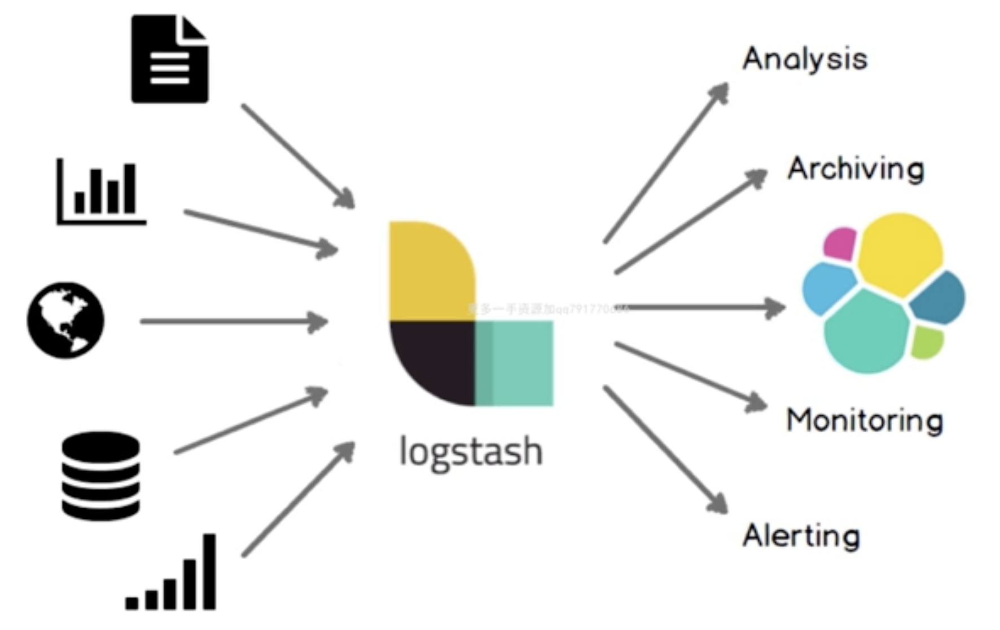

# Logstash

- `数据收集处理引擎`
- `ETL`工具

## 架构介绍

### `Pipline`

> - `input-filter-output`的`3`阶段处理流程
> - `队列管理`
> - `插件`生命周期
> - 主要如下设置类型
>   - 布尔类型`boolean`
>     - `isFailed=>true`
>   - 数值类型`number`
>     - `port=>33`
>   - 字符串类型`string`
>     - `name=>"hello world"`
>   - 数组`Array/List`
>     - `users => [{id=>1,name=>bob},{id=>2,name=>glod}]`
>     - `Path => ["var/log/message","var/log/*.log"]`
>   - 哈希类型`Hash`
>     - `match=>{"filed1"=>"value1","field2"=>"value2"}`
> - 注释 `#`
> - 在配置中可以引入 `logstash event`的属性(字段),主要有如下两个方式
>   - 直接引用`字段值`
>     - 使用中括号`[字段 key]`多层多个`[][]`
>   - 在字符串中引用`sprintf`方式引用
>     - 使用`%{}`来实现,引入嵌套类型`%{[][]}`来实现
> - `pipline`配置
>   - `input`
>     - `stdin`
>       - 从`标准输入` `读取数据`
>         - `codec`类型为`codec`
>         - `type`类型为 `string`,自定义该`事件`的类型,可用于后续判断
>         - `tags`类型为`array`,自定义该事件的`tag`,可用于后续的判断
>         - `add_field`的类型为 `hash`,为该事件添加`字段`
>     - `kafka`
>     - `file`
>   - `filter`
>   - `output`
> - 支持简单的判断表达式
> - 
> - 表达式主要包含如下操作符
>   - `比较`: `== != < > <= >=`
>   - `正则是否匹配`:`=~ !~`
>   - `包含(字符串或者数组)`:`in 、not in`
>   - `布尔操作符`:`and、or、nand、xor、!`
>   - `分组操作符`:`{}`
>   - 

### `LogStash`

> - 内部流转的数据表现形式
> - 原始数据在`input`被转换为`Event`,在`output,envent`被转换为目标格式数据
> - 在配置文件中可以对`Event`中的属性进行`增删改查`

`input decoding`

`output encoding`

`6.0中 es 的架构`

### `Queue`

- `In Memory`
  - 无法处理`crash`、机器宕机等情况,会导致`数据丢失`
- `Persistent Queue In Disk`
  - 可处理进程`Crash`等情况,保证数据不丢失
  - 保证数据至少消费一次
  - 充当缓冲区,可以替代`Kafka`等消息队列的作用
  - 
- `性能对比`
  - 
  - 建议一般没特殊需求使用`persisted`
    - 默认是`memory`
  - queue.max_btyes:4gb
    - 队列存储最大数据量

### `线程架构`

- 相关配置
  - `pipline.workers | -w`
    - `Pipline`线程数,即`filter_output`的处理线程数,默认是`cpu`的核数`
  - `pipline.batch.size | -b`
    - `batcher`一次获取的待处理文档数,默认为 `125`,可以根据输出进行调整,越大会占用更多的 `heap`空间,可以通过 `jvm options`的调整
  - `pipline.batch.delay | -u`
    - `batcher` 等待的时长默认为`ms`

## `logstash配置文件`

- `logstash`设置相关配置(在`conf`文件夹中, `setting files`)
  - `logstash.yml` logstash 相关配置文件,比如`node.name`、`queue.type`等,这其中的配置可以被命令行参数中的相关参数覆盖
  - `jvm.options`修改`jvm`的相关参数,比如修改`heap size`等
- `pipline`配置文件
  - 定义数据处理流程的文件, 以`.conf`结尾
- `配置参数`讲解
  - `node.name`
    - 节点名称,定义一些比较具有意义的
  - `path.data`
    - 持久化存储数据的文件夹,默认 `logstash`目录下的`home`文件夹
  - `path.config`
    - 设置`pipline`配置文件的目录
  - `path.log`
    - 设定`pipline`日志文件的目录
  - `pipline.workers`
    - 设定`pipline`的线程数(`filter+output`),优化常用项
  - `pipline.batch.size/delay`
    - 设定批量处理数据的数目和延迟
  - `queue.type`
    - 设定队列类型,默认是`memory`
  - `queue.max_bytes`
    - 队列总容量默认为 `1G`
- `命令行配置`覆盖
  - `—node.name`
  - `-f —path.config pipline`路径可以是文件.也可以是文件夹
  - `—path.setting` logstash配置文件路径,其中必须包含`logstash.yml`
  - `-e —config.string`指定`pipline`内容,多用于测试
  - `-w --pipline workers`
  - `-b --pipline.batch.size`
  - `—path.data`
  - `--debug`
  - `-t —-config.test_and_exit`
- 线上环境建议使用配置文件来配置`logstash`去配置相关配置,这样可以减少犯错的机会,而且文件便于进行版本化管理
- 命令行形式多采用进行快速配置`测试,验证,检查`等

