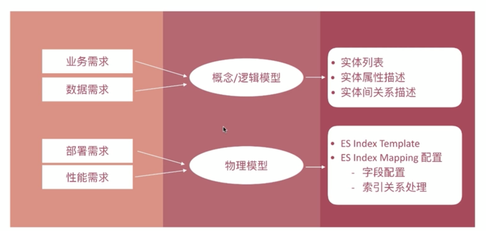
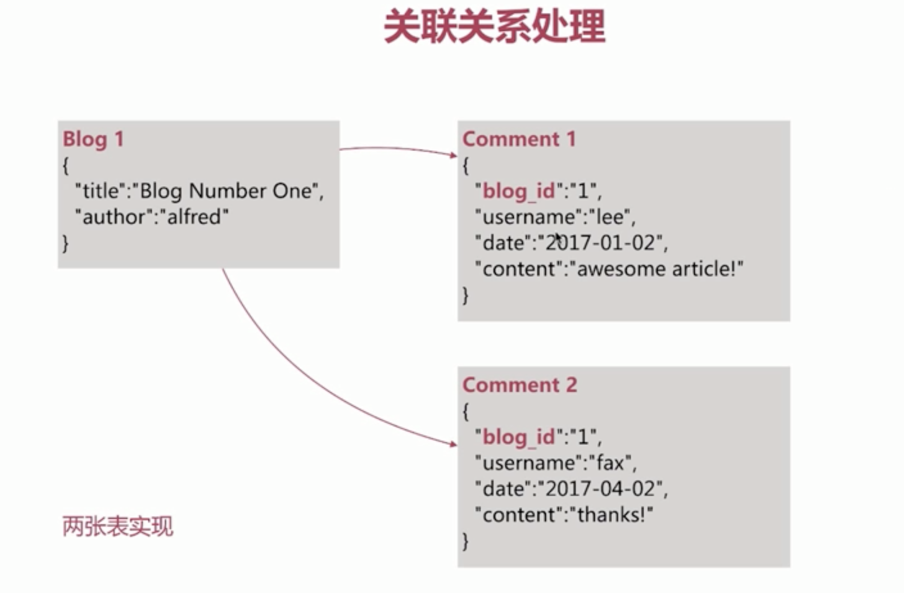
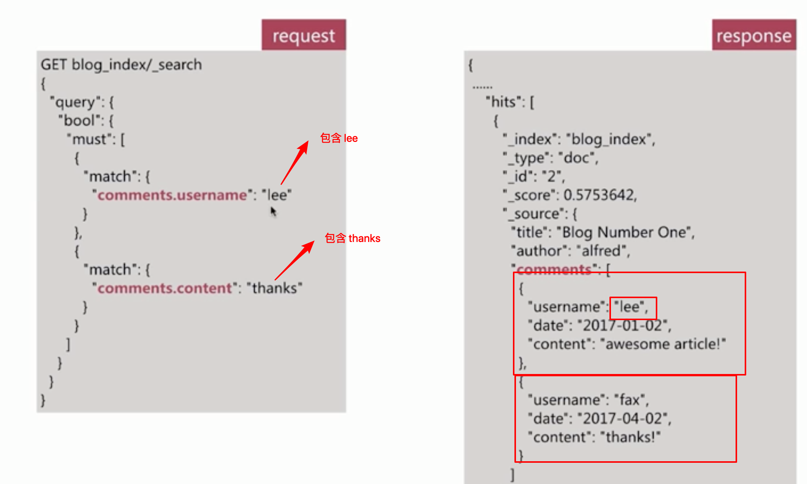
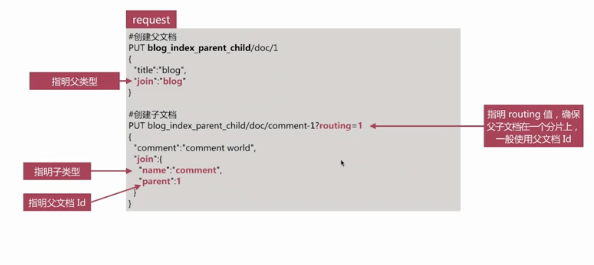
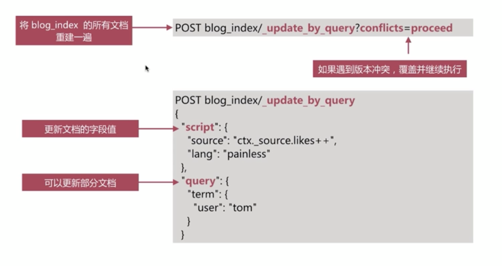

## 数据建模的过程

- `概念模型`
  - 确定系统的系统需求和`核心`边界,设计实体和实体之间的过膝
- `逻辑模型`
  - 进一步梳理业务需求,确定每个实体的属性、关系和约束等
- `物理模型`
  - 结合具体的`数据库`产品,在`满足业务` `读写性能`等需求的前提下`确定最终`的`定义`
  - Mysql、MongoDB 、elasticsearch 等
  - 第三范式

#### es 中的数据建模

- `es`是基于Lucene以倒排索引为基础实现的存储体系,不遵守关系型数据库的`范式约定`
- 

#### Mapping 字段的相关设置

- `enable`

  - `true`|`false`
  - 仅`存储`,不做`搜索`或聚合分析 ———— 例:`cookies` 或者 `session`

- index

  - `true`|`false`
  - 是否构建`倒排索引`

- index_options

  - `docs`|`freq`|`position`|`offset`
  - 存储`倒排索引`的哪些信息

- norms

  - `true`|`false`
  - 是否存储`归一化`相关参数,如果字段仅用于`过滤`和`聚合分析`,可关闭

- doc_values

  - `true`|`false`
  - 用于`排序`和`聚合分析`

- Field_data

  - `true`|`false`
  - 是否为`text`的类型启用 field_data,实现`排序`和`聚合分析`

- store

  - `true`|`false`
  - 是否存储该字段的值

- coerce

  - `true`|`false`
  - 是否`开启`自动数据类别转换转换,比如`字符串`转为`数字` ,`浮点`转为`整形`等,默认为 `true`

- multifields多字段

  - 灵活使用多字段的`特性`来解决多样的`业务需求`

- dynamic

  - `true`|`false`|`strict`
  - 控制`mapping `的自动更新 —————> 建议设置成`false`和`strict`

- date_detection

  - `true`|`false`
  - 是否自动识别日期类型

- 

- `字符串类型`

  - 需要分词则生成 `text`,否则生成` keyword `类型

- `枚举类型`

  - 基于性能考虑,建议设成 `keyword` 类型,即便是`整形`

- `数值类型`

  - 尽量选择贴近的`类型`,比如` byte` 即可表示所有的数值时建议选择 `byte`,不要选择`long`

- `其他类型`

  - 比如`布尔类型`、`日期`、`地理位置数据等`

- 完全不需要`检索`、`排序`、`聚合分析`的字段

  - `enabled` 设置成` true`

- 不需要`检索`的字段

  - `index`设置为 `false`

- 需要`检索`的字段,可以通过如下配置设定需要存的`存储粒度`

  - `index_options`结合需要设定
  - `norms`不需要`归一化`数据时关闭即可

- 不需要`排序`或者`聚合分析`

  - `doc_values` 设定为` false`
  - `fielddata`设定为`false`

- 是否需要专门存储当前文档的数据

  - `store`设置为` true`,即可存储该字段的`原始内容`(与`_source`中的不相关)
  - 一般结合`_source`的 `enabled`设定为 `false`时使用

- > `实例分析`
  >
  > 博客文章 blog_index
  >
  > - 标题  title
  > - 发布日期  publish_date
  > - 作者  author
  > - 摘要  abstract
  > - 内容  content
  > - 网络地址  url
  >
  > ```json
  > DELETE blog_index
  > PUT blog_index
  > {
  >   
  >   "mappings": {
  >     "_source": {
  >       "enabled": false
  >     }, 
  >     "properties": {
  >       "title":{
  >         "type": "text",
  >         "fields": {
  >           "keyword":{
  >             "type":"keyword",
  >             "ignore_above":100
  >           }
  >         },
  >         "store": true
  >       },
  >       "public_date":{
  >         "type": "date",
  >         "store": true
  >       },
  >       "anthor":{
  >         "type": "keyword",
  >         "store": true
  >       },
  >       "abstract":{
  >         "type": "text",
  >         "store": true
  >       },
  >       "content":{
  >         "type": "text",
  >         "store": true
  >       },
  >       "url":{
  >         "type": "keyword",
  >         "norms": false,
  >         "doc_values":false,
  >         "ignore_above": 10, 
  >         "store": true
  >       }
  >     }
  >   }
  > }
  > 
  > PUT blog_index/_doc/1
  > {
  >   "title":"blog_title",
  >   "content":"blog content"
  > }
  > 
  > GET blog_index/_search
  > {
  >   "stored_fields": ["title"],
  >   "query": {
  >     "match": {
  >       "content": "blog"
  >     }
  >   },
  >   "highlight": {
  >     "fields": {"content":{}}
  >   }
  > }
  > ```

- 关联关系处理

  - 关系型数据处理方法

  - 

  - `es`不擅长处理的关系型数据库中的关联关系,比如文章表`blog`与评论表`comment`之间通过`blog_id`关联,在`es`中可以通过如下两种手段变相解决

    - `Nested Object`

      - 实现

      - 

      - 执行查询

      - 

      - 存储时其实是按照以下存储

      - 

      - 如何解决这类问题

      - es 提供了Nested object 来解决这类问题

      - 

      - 解决这类问题的关键是,存储时作为独立存储

      - 

      - ```json
        DELETE blog_index
        
        PUT blog_index/_doc/1
        {
          "title":"Blog Number One",
          "author":"alfred",
          "comments":[
            {
              "username":"lee",
              "date":"2017-01-02",
              "content":"awesome article"
            },
            {
              "username":"fax",
              "date":"2017-04-02",
              "content":"thanks!"
            }
            ]
        }
        GET blog_index/_mapping
        
        GET blog_index/_search
        {
          "query": {
            "bool": {
              "must": [
                {
                  "match": {
                    "comments.username": "lee"
                  }
                },
                {
                  "match": {
                    "comments.content": "thanks"
                  }
                }
              ]
            }
          }
        }
        
        PUT blog_index_nested
        {
          "mappings": {
            "properties": {
              "author": {
                "type": "text",
                "fields": {
                  "keyword": {
                    "type": "keyword",
                    "ignore_above": 256
                  }
                }
              },
              "comments": {
                "type": "nested", 
                "properties": {
                  "content": {
                    "type": "text",
                    "fields": {
                      "keyword": {
                        "type": "keyword",
                        "ignore_above": 256
                      }
                    }
                  },
                  "date": {
                    "type": "date"
                  },
                  "username": {
                    "type": "text",
                    "fields": {
                      "keyword": {
                        "type": "keyword",
                        "ignore_above": 256
                      }
                    }
                  }
                }
              },
              "title": {
                "type": "text",
                "fields": {
                  "keyword": {
                    "type": "keyword",
                    "ignore_above": 256
                  }
                }
              }
            }
          }
        }
        
        PUT blog_index_nested/_doc/1
        {
          "title":"Blog Number One",
          "author":"alfred",
          "comments":[
            {
              "username":"lee",
              "date":"2017-01-02",
              "content":"awesome article"
            },
            {
              "username":"fax",
              "date":"2017-04-02",
              "content":"thanks!"
            }
            ]
        }
        
        GET blog_index_nested/_search
        {
          "query": {
            "nested": {
              "path": "comments",
              "query": {
                "bool": {
                  "must": [
                    {
                      "match": {
                        "comments.username": "lee"
                      }
                    },
                    {
                      "match": {
                        "comments.content": "awesome"
                      }
                    }
                  ]
                }
              }
            }
          }
        }
        ```

    - `Parent`/`Child`

      - 提供数据库类似`join`的实现,使用`join`的数据类型, 是 `6.2` 版本之后才有的
      - 
      - 

      - 常见的`query`语法包括以下几种

        - `parent_id`返回某父文档的子文档

          - 

        - `has_child`返回包含某子文档的父文档

          - 

        - `has_parent`返回包含某父文档的子文档

          - 

        - ```json
          PUT blog_index_parent_child
          {
            "mappings": {
              "properties": {
                "join":{
                  "type": "join",
                  "relations":{
                    "blog":"comment"
                  }
                }
              }
            }
          }
          
          PUT blog_index_parent_child/_doc/1
          {
            "title":"blog",
            "join":"blog"
          }
          PUT blog_index_parent_child/_doc/2
          {
            "title":"blog2",
            "join":"blog"
          }
          
          PUT blog_index_parent_child/_doc/comment-1?routing=1
          {
            "comment":"comment world",
            "join":{
              "name":"comment",
              "parent":1
            }
          }
          
          PUT blog_index_parent_child/_doc/comment-2?routing=2
          {
            "comment":"comment hello",
            "join":{
              "name":"comment",
              "parent":2
            }
          }
          GET blog_index_parent_child/_search
          {
            "query": {
              "parent_id":{
                "type":"comment",
                "id":2
              }
            }
          }
          
          GET blog_index_parent_child/_search
          {
            "query": {
              "has_child": {
                "type": "comment",
                "query": {
                  "match": {
                    "comment": "world"
                  }
                }
              }
            }
          }
          
          GET blog_index_parent_child/_search
          {
            "query": {
              "has_parent": {
                "parent_type": "blog",
                "query": {
                  "match": {
                    "title": "blog"
                  }
                }
              }
            }
          }
          ```

      - | 对比 |          Nested Object           |                  Parent/Child                  |
        | :--: | :------------------------------: | :--------------------------------------------: |
        | 优点 |  文档存储在一起,因此读取性能高   |         父子文档可以独立更新,互不影响          |
        | 缺点 | 更新父或子文档时需要更新整个文档 | 为了维护 join的关系,需要占用部分内存读取性能差 |
        | 场景 |     子文档偶尔更新,查询频繁      |                 子文档更新频繁                 |

         建议尽量选择`nested object ` 来解决这类问题

#### Reindex

- 指重建所有数据的过程,一般发生在如下情况
  - `mapping` 设计变更,比如`字段类型变化`,`分词器字典更新`等
  - `index`设计变更,比如`分片数更改等`
  - 迁移数据
- `ES`提供了现成的`api`用于完成该工作
  - `_update_by_query`在现有索引上重建
  - 
  - `_reindex`在其他索引上重建
  - 