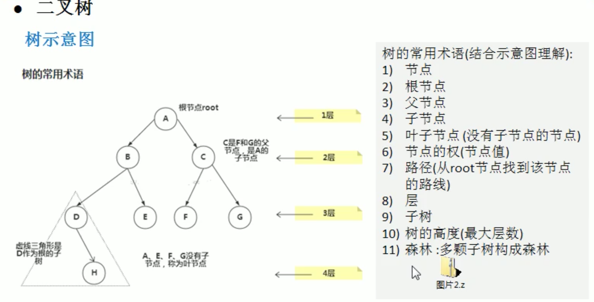

# 数据结构和算法

## 简介

### 数据结构和算法的重要性

> - 算法是程序的灵魂, 优秀的程序可以再海量数据计算时, 依然保持高速计算
> - 一般来讲程序会使用内存计算框架(比如`Spark`)和缓存技术(比如`Redis等`)来优化程序,再深度的思考一下, 这些`计算框架`和`缓存技术, 他的核心功能是哪个部分?`
> - 拿实际工作经历来说, 在Unix开发服务器程序, 功能是要支持上千万人同时在线, 在上线前, 做内测, 一切OK, 可上线后, 服务器就支持布置了, 公司的CTO对代码进行优化, 再次上线, 坚入磐石, 你就能感受道程序是有灵魂的, 就是算法
> - 目前程序员面试的门槛越来越高, 很多一些IT公司, 都会有数据结构和算法面试题
> - 如果你不想永远都是代码工人, 那就花时间来研究下数据结构和算法

### 数据结构和算法的介绍

> - 数据data结构(`structure`)是一门研究组织`数据`方式的学科, 有了编程语言也就有了数据结构, 学好数据结构可以编写出更有效率的代码
> - 学好数据结构就要多多考虑如何将生活中遇到的问题,用程序去实现解决
> - 程序 = `数据机构` + 算法 

## 数据结构

### 线性结构

- 线性结构为`最常用的数据结构`,其特点是数据元素之间存在一对一的线性关系
- 线性结构有两种不同的存储结构, 既`顺序存储结构`和`链表存储结构`,顺序存储的线性表为`顺序表`,顺序表中的存储元素是连续的
- `链式存储`的线性表成为链表, 链表中的存储元素不一定是连续的, 元素节点中存放数据元素以及相邻元素的地址信息
- 线性结构常见的有:`数组、队列、链表和栈`

### 非线性数组

- 非线性数据包括:`二维数组, 多维数组, 广义表, 树结构, 图结构`


### 队列

- `简介`
  - 队列是一个有序列表,可以用`数组`或者`链表`来实现
  - 遵循`先入先出`的原则. 既: 先存入队列的数据, 要先取出. 后存入的要后取出

- `示意图`

  - 

- `数组模拟队列`

  - ```markdown
    - 队列本身是有序列表, 若使用数组的结构来存储队列的数据, 其中队列数组的声明如上图, 其中maxSize是该队列的最大容量
    - 因为队列的输出、输入是分别从前后端来处理, 因此需要两个变量`front`和`rear`分辨记录队列前后端的下标,`front`会随着数据输出而变化,而`rear`则是随着数据输入而变化,如上图所示
    ```

- `思路分析`

  - 当我们将数据存入队列时成为`addQueue`, `addQueue`的处理需要两个步骤: `思路分析`
    - 将尾指针网后移动: rear + 1,当front == rear [空]
    - 若尾指针`rear`小于队列的最大下标`maxSize-1`,则将数据存入`rear`所指的数组元素中,否则无法存入数据. `rear==maxSize-1`[队列满]

- `问题分析并优化`

  - 目前数组使用一次就不能用, 没有达到复用的效果
  - 将这个数组使用算法, 改进成一个环形的队列 取模: %

### 环形队列

- `思路如下`
  - `front`变量的含义做一个调整: front执行指向队列的第一个元素, 也就是说arr[front]就是队列的第一个元素 `front的初始值=0`
  - `rear`变量的含义做一个调整: `rear`指向队列的最后一个元素的后一个位置. `rear的初始值=0`
  - 当队列满时, 条件是 `(rear + 1) % maxSize= front`
  - 当队列为空的条件, `rear==front`空

### 单链表

- `介绍`
  - 链表是有序的列表,但是他在内存中是存储如下
- `图示`
  - 
- `图示总结`
  - 链表是以节点的方式存储的
  - 每个节点包含`data`域, `next`域:指向下一个节点
  - 链表的各个节点不一定是连续存储的
  - 链表分带头节点的链表和没有带头节点的链表吗, 根据实际的需求来确定
- `单链表`
  - 示例
  - 
  - 实现细节
    - 先创建一个`head`头节点，作用就是表示单链表的头
    - 后面我们每天假一个节点，就直接加入到链表的最后
    - 遍历：
      - 通过一个辅助遍历，帮助遍历整个链表

### 双向链表

- `与单向链表的区别`
  - 单向链表, 查找的方向只能是一个方向,而双向链表可以向前或者向后查找
  - 单向链表不能自我删除, 需要靠辅助接点, 而双向链表,则可以`自我删除`,所以前面我们单链表删除时接点,总是找到`temp`,`temp`时待删除接点的前一个节点
- `图示`
  - 
- `双向链表的遍历, 添加, 修改, 删除的思路`
  - 遍历从前或者后都可以
  - 添加
    - 先找到双向链表的最后一个节点`temp`
    - `temp.next = node`
    - `node.pre = temp`
  - 修改
  - 删除
    - 因为是双向链表,因此,我们可以实现自我删除某个节点
    - 直接找到要删除的节点,比如 `temp`
    - `temp.pre.next=temp.next`实现删除
    - `temp.next.pre = temp.pre`

### 单向环形

- `Josephu(约瑟夫问题)`
  - 设置编号为`1,2,...n`的n个人围坐一圈,约定编号为`k(1<=k<=n)`的人从1开始计数,数到m的那个人出列,阿德下一位又从1开始报数,数到m的那个人又出列,依次类推,知道所有人出列位置,`由次产生一个出队编号的序列`
- `图示`
  - 
- `思路`
  - 1. 先创建第一个节点, 让`first`指向该节点, 并形成环形
    2. 后面当我们没创建一个新节点, 就把该节点, 加入到已有的环形链表中即可
  - `遍历环形链表`
    - 1. 先考虑条件需要起始的位置 `startId`,步数`step`, 总数`count`
      2. 获取结束链表最后一个的数据的指针`lastTemp`
      3. 移动到起始`startId`所在的位置
      4. 判断当`lastTemp==startTemp`,取出结束,其中有置换对接的过程

### 栈(stack)

- `简介`
  - 栈是一个`先入后出`的有序列表
  - `栈`是限制线性表中元素的插入和删除`只能在线性表的同一端`进行的一中特殊的线性表, 允许插入和删除的一端,为变化的一端,称为`栈顶`,另一端为固定的一端, 称为`栈底`
  - 根据栈的定义可知,最先放入栈中元素在栈底,最后放入的元素在栈顶,二删除元素刚好相反,最后放入的元素最先删除没最先放入的元素最后删除
- `出栈和入栈的概念`
  - 
- `应用场景`
  - 1. 子程序的调用: 在跳往子程序前,回显将下个指令的地址存到堆栈中,知道子程序执行完后再地址只取出,一回到原先的程序中
    2. 处理递归调用: 和子程序的调用类似, 只是出了储存下一个指令的地址外,也将参数、区域变量等数据存入堆栈中
    3. 表达式的转化`[中缀表达式转后缀表达式]`与求值问题
    4. 二叉树的遍历
    5. 图形的深度优先搜索算法
- `实现栈的思路分析`
  - 1. 使用数组来模拟栈
    2. 定义一个`top`来表示栈顶, 初始化为-1
    3. 入栈的操作,当有数据加入到栈时, top++,stack[top]=data;
    4. 出栈的操作, int value = stack[top];top--;return value

### 递归

- `迷宫回溯问题`
  - 
- `图解`
  - 
- `递归需要遵守的规则 ---> 如上述图示`
  - 执行一个方法是,就创建一个新的受保护的`独立空间(栈空间)`
  - 方法的`局部变量是独立`的,不会互相影响,比如n变量
  - 如果方法中使用的`是引用类型的变量`(比如数组),就会共享改引用类型的数据
  - 递归`必须向退出递归的条件`逼近,否则就是无限循环
  - 当一个方法执行完毕,或者`遇到return就会返回`,遵守谁调用,就将结果返回给谁,同事当方法执行完毕或者返回时,该方法也执行完毕

### 哈希表

- `别名`
  - 散列表
- 是通过`hash + 链表的方式实现`

### 二叉树

- `出现的原因`

  - > - `数组存储方式`的分析
    >   - `优点`: 通过下标访问元素,速度快. 对于有序数组, 还可使用二分查找提高检索速度
    >   - `缺点`: 如果要检索具体某个值, 或者插入值(按一定顺序)会整体移动, 效率较低
    >   - `数组扩容`: 每次在底层都需要创建新的数组,要讲原来的数据拷贝到数组,并插入新的数据
    > - `链表存储方式`的分析
    >   - `优点`: 在一定程度上对数组存储方式的优化(比如:插入一个数值节点,只需要将插入节点,连接到链表中即可,删除效率也很好)
    >   - `缺点`: 在进行检索时, 效率仍然较低, 比如(检索某个值, 需要从头节点开始遍历)
    > - `树`存储方式的分析
    >   - 能提高数据`存储,读取`的效率,比如利用二叉排序树,既可以保证数据的检索速度,同事也可以保证数据的插入, 删除, 修改的速度
  
- `图解`



- `概念`
  - 树有很多种,每个节点最多只能有两个子节点的一种形式称为二叉树
  - 二叉树的子节点分为 左节点和右节点
  - 如果该二叉树的所有叶子节点都在最后一层,并且节点总数是 `2^n` - 1, n为层数,则我们称为满二叉树
  - 如果该二叉树的叶子节点都在最后一层或者倒数第二层,而且最后一层的叶子节点在左边连续,倒数第二层叶子节点在右边连续,我们称为完全二叉树
- `二叉树遍历说明`
  - 前序遍历: `先输出父节点`, 在遍历左子树和有子树
  - 中序遍历: 先遍历左子树,`在输出父节点`,再遍历右子树
  - 后序遍历: 先遍历左子树,再遍历右子树,`最后输出父节点`

### 顺序存储二叉树

- `基本思想`
  - 从数据存储来看,`数组存储方式`和`树的存储`可以互相转换,树也可以转换成数组
- `特点`
  - 顺序二叉树只考虑完全二叉树
  - 第 n 个元素的左子节点为 2*n+1
  - 第 n 个元素的右子节点 2*n+2
  - 第 n 个元素的父节点为(n-1)/2 
  - n: 表示二叉树中的第几个元素

### 线索二叉树

- `基本思想`
  - n个节点的二叉链表中含有`n+1`**[共识2n -（n-1）= n + 1]个空指针域， 利用二叉链表中的空指针域，存放执行节点在某种遍历次序下的前驱和后继节点的指针（这种附加的指针称为“线索”）
  - 这种加上了线索二叉链表为线索链表，相应的二叉树陈伟线索二叉树，根据线索性质的不同，线索二叉树可分为前序线索二叉树，中序线索二叉树，和后续线索二叉树三种
  - 一个节点的前一个节点，称为`前驱`节点
  - 一个节点的后一个节点，称为`后继`节点
- `说明`
  - `left`指向的是左子数，也可能是指向前驱节点，比如1节点left指向的左子树，而10节点的left指向的就是前驱节点
  - `right`指向的是右子树，也可能是指向后继节点， 比如1节点right指向右子树，而10节点指向right指向的后继节点
- `线索二叉树理解`
  - 我们要区分是树节点还是前后驱节点
    - 我们在node节点上存储是加上两个区分参数`LeftType=0`代表树节点`LeftType=1`代表前驱节点反之又节点`LeftType`也是一样子的
- `图解`
  - 
  - 10是一个普遍规律指向当前树节点的前二级节点

### 二叉排序树

- `基本概念`
  - 对于二叉排序树的任何一个非叶子结点,要求左子节点的值比当前节点的值小,右子节点的值比当前节点的值大
  - 如果有相同的值,可以将该节点放在左子节点或右子节点
  - 
- `存在的问题`
  1. 左子树全部为空,从形式上,更像一个单链表
  2. 插入速度没有影响
  3. 查询速度明显降低(应为需要依次比较),不能发挥 BST的优势,因为每次还需要比较左子树,其查询速度比单链表还慢
  4. 解决方案-**平衡二叉树**

### 平衡二叉树

- `基本介绍`
  - 平衡二叉树也叫**平衡二叉检索树**又被称为 AVL 树,可以保证查询效率较高
  - 具有以下特点: 它是一颗空树或它的左右两个子树的高度差的绝对值不超过 1 并且左右两个子树都是一颗平衡二叉树. 平衡二叉树的常用实现方法有**红黑树、AVl、替罪羊树、Treap、伸展树**等
- `基本概念`
  - 平衡二叉树是通过二叉排序树的改进版本,是通过下面几种方法来实现的
    - 左旋
    - 右旋
    - 自旋转
- `存在的问题`
  - 二叉树的操作效率较高,但是也存在问题,请看下面的二叉树
  - 
  - 二叉树需要加载到内存的,如果二叉树的节点少,没有什么问题,但是如果二叉树的节点很多,就存在**以下问题**
    - 在构建二叉树时,需要多次进行 i/o 操作(海量数据存在数据库或文件中), 节点海量, 构建二叉树是,速度有影响
    - 节点海量, 也会造成二叉树的高度很大,会降低操作速度

### 多路查找树

#### 多叉树

> `基本介绍`
>
> - 在二叉树中,每个节点有数据项,最多只有两个子节点. 如果允许每个节点可以有更多的数据项和更多的子节点, 就是多叉树
> - 多叉树通过重新组织节点,减少树的高度,能对二叉树进行优化
> - 例 2-3 树,2-3-4 树就是多叉树
> - 

##### B 树

> `基本概念`
>
> - B 树通过重新组织节点,降低树的高度,并且减少 i/o 读写次数来提升效率
> - 
> - B树通过重新组织节点,降低树的高度
> - 文件系统和数据库系统的设计者利用磁盘预读原理,将一个节点大小设置等于一个页(页得大小通常 4K),这样每个节点只需要依次 i/o 就可以完全载入
> - 将书的度 M 设置 1024,在 600 亿个元素中最大只需要 4 次 i/o 操作就可以读取到想要的元素, B 树(B+树)广泛用于文件系统以及数据库系统中
>
> `B树的介绍`
>
> - `B-tree`树即 **B树**,平衡的意思,有人把**B-tree**翻译成 **B-树**,容易让人产生*误会*,会以为*B-树*是一种树,而 B树优势另一种树.实际上,`B-tree`就是指的是`B 树`
> - 
>
> `B树的说明`
>
> - B树的阶: 节点最多子节点个数,比如果2-3树的阶是3, 2-3-4树的阶是4
> - B-树的搜索,从根节点开始,对节点内的关键字(有序)序列进行二分查找, 如果命中则结束,否则进入查询关键字所属范围的儿子节点;重复,知道所对应的儿子指针为空, 或已经是叶子节点
> - 关键字集合分布在整棵树中,既叶子节点和非叶子节点都存放数据
> - 搜索有可能在非叶子节点结束
> - 其搜索性能等价于在关键字全集内做一次二分查找

###### 2-3 树

> `特点`
>
> - 2-3 树的所有叶子节点都在同一层(只要是 B 树都满足这个条件)
> - 有两个子节点的节点叫 二节点,二节点要么没有子节点,要么你没有两个子节点
> - 有三个子节点的节点叫三节点,三节点要么没有子节点,要么有三个子节点
> - 2-3 树是由二节点和三节点构成的树

###### 2-3-4树

> `图解`
>
> 

##### B+树

> `介绍`	
>
> - B+树是B树的变体,也是一种多路搜索树
>
> `说明`
>
> - B+树的搜索与B树也基本相同,区别是B+树只有达到叶子节点才命中**(B树可以再飞叶子节点命中)**,其性能也等价于在关键字全集做一次二分查找
> - 所有**关键字都出现在叶子节点的链表中**(既数据只能在叶子节点**[也叫稠密索引]**),且链表中的关键字(数据)恰好是有序的
> - 不可能在非叶子节点命中
> - 非叶子节点相当于叶子节点的索引**()稀疏索引**,叶子节点相当于是存储(关键字)数据的数据层
> - 更适合文件索引系统
> - **B树和B+树**各有自己的应用场景,不能说B+树完全比B树号,反之亦然
>
> `图解`
>
> 

##### B*树

> `介绍`
>
> - `B*树`是`B+树`的变体, 在`B+树`的非根和飞叶子节点在增加指向兄弟的指针
>
> `图解`
>
> 
>
> `说明`
>
> - `B*树`定义了非叶子节点关键字个数至少为**(2/3)*M**,既块的最低使用率为**2/3**,而**B+**树的块的最低使用率为`B+树`的`1/2`
> - 从第1个特点我们可以看出,`B*树`分配新节点的概率比`B+`树要低,空间使用率要高

### 图

> `为什么存在图这种数据结构`
>
> -  上面有介绍线性表和树
> - 线性表局限于一个直接前驱和一个直接后继的关系
> - 树也只能有一个直接前驱也就是父节点
> - 当我们需要表示`多对多关系`时,这里我们就用到了图
>
> `介绍`
>
> - 图是一种数据结构,其中节点具有零个或多个相邻元素,连个节点之间的连接成为边,节点也可以称为顶点
>
> `图解`
>
> - 顶点(vertex)
> - 边(edge)
> - 路径
> - 无向图(下图)
>   - 无向图: 顶点之间的连接没有方向,比如A->B,既可以是A->B也可以是B->A
>   - 比如从D->C的路径有
>     - D->B->C
>     - D->A->B->C
>
> 
>
> - 有向图
>
>   - 有向图: 顶点之间是有方向的
>   - 带权图: 边是有权值的
>
>   
>
> `图的表示方式`
>
> - 二维数据表示(邻接矩阵)
>   - 邻接矩阵: 表示图形中顶点之间相邻关系的举证,对于n个顶点的图而言,矩阵是row和col表示的是1...n个点
>
> 
>
> - 链表表示(邻接表)
>   - `邻接矩阵`需要为每个顶点都分配`n`个边的空间, 其实很多边都是不存在的,会造成空间的一定损失
>   - 邻接表的是先只惯性存在的编,不关心不存在的边. 因此没有空间浪费, 邻接表由`数组+链表组成`
>
> 
>
> `图的遍历介绍`
>
> - 所谓图的遍历,既对节点的访问.一个图有那么多个节点,如何遍历这些节点,需要特定策略,一般有两种访问策略:
>   - 深度优先遍历
>   - 广度优先遍历
> - 深度优先搜索(Depth First Search)
>   - `思想`
>     - **深度优先遍历**,从初始访问节点触发,初始访问节点可能有多个**邻接节点**,深度优先遍历的策略就是首先访问第一个邻接节点,然后再以这个被访问的**邻接节点**作为初始节点,访问它的第一个邻接节点,可以这样理解: 每次都在访问完**当前节点**后受限访问**当前节点的第一个邻接节点**
>     - 我们可以看到,这样的访问策略是优先纵向挖掘深入,而不是对一个节点的所有**邻接节点**进行横向访问
>     - 显然深度优先搜索时一个递归的过程
>   - `算法步骤`
>     - 访问初始节点v,并标记节点v已被访问
>     - 查找节点v的第一个邻接点
>     - 若w存在,则继续执行4,如果w不存在,则会到第一步,将从v的下一个节点继续
>     - 若w未被访问,对w进行深度优先遍历递归(既把w当做另一个v,然后进行步骤123)
>     - 查找节点v的w邻接节点的下一个邻接节点,转到步骤3
> - 广度优先搜索(Broad First Search)
>   - `思想`
>     - 类似于一个分层搜索的过程,广度优先遍历需要使用一个队列保持访问过的节点的顺序, 以便按这个顺序来访问这些节点的邻接节点
>   - `算法步骤`
>     - 访问初始节点v并标记节点v为已访问
>     - 节点v入队列
>     - 当队列非空时,继续执行,否则算法结束
>     - 出队列,取得队头节点u
>     - 查找节点u的第一个邻接点w
>     - 查找节点u的第一个邻接结点w
>     - 若节点u的邻接点w不存在,则转至步骤3;否则循环执行以下三大步骤
>     - 若节点w尚未被访问,则访问节点w并标记为已访问
>     - 节点w入队列
>     - 查找节点u的继w邻接点后的下一个邻接点w,转至步骤6

## 排序算法

### 排序算法的基本介绍

#### 排序的规则

- 内部排序: 指将需要处理的所有数据都加在到内部存储器中进行排序
- 外部排序: 数据量过大,无法全部加载到内存中,需要借助外部存储进行排序
- `图解`


- 

#### 算法的时间复杂度

- 事后统计法

  - 这种方法可行, 但是有两个问题: 一是要相对设计的算法的运行性能进行评测,需要实际运行该程序; 二是所得事件的统计量依赖于计算机的硬件、软件等环境因素,`这种方式,要在对同一台计算机的相同状态下运行,才能比较那种算法速度较快`

- 事后估算的方法

  - 通过分析某种算法的时间复杂度来判断哪种算法更优

- 图解

  - 


#### 时间复杂度主要概念

- 一般情况下,算法中的基本操作语句的重复执行次数是问题规模` n`的某个函数,用 **T(n)**表示,若有某个辅助函数**f(n)**,是的当 `n`趋近与无穷大时, `T(n)/f(n)`的极限值为不等于零的常熟,则称 `f(n)`是 `T(n)`的同数量级函数, 记做 **T(n) = O(f(n))**,称为 **O(f(n))**为算法的渐进时间复杂度,简称**时间复杂度**
- **T(n)**不同, 但时间复杂度可能相同, 如果: **T(n)=n^2 + 7n + 6** 与 **T(n) = 3n^2 + 2n + 2**它们的 T(n)不同, 但时间复杂度相同,都是 **T(n)**
- 计算时间复杂度的方法
  - 用常熟 1 代替运行时间中的所有假发常熟
  - 修改后的运行函数中,只保留最高阶项
  - 取出最高阶项的系数
- 图解
  - 

#### 时间复杂度图解


- `相关术语`
  - **稳定**: 如果a原本在b前面, 而a=b, 排序之后a仍然在b的前面
  - **不稳定**: 和**稳定**相反
  - **内排序**: 所有排序都在内存中完成
  - **外排序**: 由于数据太大,因此把数据放在磁盘中,而排序通过磁盘和内存的数据传输才能进行
  - **时间复杂度**: 一个算法执行所耗费的时间
  - **空间复杂度**: 运行完一个程序所需要内存的大小
  - **n**: 数据规模
  - **k**:"桶"的个数
  - **In-space**: 不占用额外内存
  - **Out-space**: 占用额外内存

### 十大排序算法

#### 冒泡排序

- `基本思想`
  - 通过对待排序序列从前向后(从下表比较小的元素开始),依次比较相邻元素的值,若发现逆序则交换,使值越大的元素逐渐从前移向后部,就像水底下的气泡一样逐渐向上冒
  - 因为排序的过程中,个元素不断接近自己的位置,如果一趟比较下来没有进行过交换,就说明序列有序,因此要在排序过程中设置一个标志 flag 判断元素是否进行过交换, 从而减少不必要的比较


- `规则`
  - 一共进行数组大小`-1`次大的排序
  - 每一趟排序的次数在逐渐地减少
  - 如果我们发现在某趟排序中没有发生一次交换,可以提前结束冒泡排序

#### 选择排序

- `基本思想`
  - 第一次先从arr[0]~arr[n-1]中选取最小值,arr[0]交换,第二次从arr[1]~arr[n-1]中选取最小值,域arr[1]交换依次类推,总共通过n-1次得到一个按排序码从小到大排列的有序序列
- `规则`
  - 在选择排序中一共有数组大小`-1`轮排序
  - 每`1`轮排序,又是一次循环,循环的规则
    - 先假定当前数时最小数
    - 然后和后面的每个数进行比较,如果发现有比当前数更小的数,就冲新确定最小数,并的到下标
  - 当遍历到数组的最后时,就得到本轮最小数和下标
  - 交换
- `实现思路`
  - 要循环arr-1次 i=0
    - 记录一个临时下标**minIndex**
    - 记录一个临时对比最小值**minValue**
    - 遍历从**arr[i]**遍历到**arr[n-1]**位
      - 如果当前下标**arr[j]**小于**minValue**
        - 赋值赋值**minValue=arr[j];minIndex=minIndex**
    - 如果**i!=minIndex**--->`说明存在数据交换`
      - **arr[minIndex] = arr[i]**
      - **arr[i] = minValue**

#### 插入排序

- `属于内部排序法`
- `基本思想`
  - 把`n`个待排序的元素看成为一个有序表和一个无序表,**开始时有序表中只包含一个元素,无需表中包含`n-1`个元素**,排序过程中每次从无序表中取出第一个元素,把它的排序码一次与有序表元素的排序码进行比较,将它插入到有序表中的适当位置,使之成为新的有序表
- `实现思路`
  - 首先我们有个数组**[a,b,c,d]**
  - 有两个临时变量存取值**insertIndex,InsertValue**
  - 第一次插入,取下标`1`的数据和下标为`0`的数据比较
    - 去除`insertVal=arr[1]->b`,因为我们要和`a`进行最后的比较`insertIndex=1-1`
    - 如果**insertVal<a**
      - 则我们会首先将`arr[1] = a`既生成`arr = [a,a,c,d]`
    - 此时我们会看到数组时`arr =  [a,a,c,d]`
    - 此时我们需要把`b`这个值插入下标为`0`的位置**arr[1-1] = b**
  - 第二次插入,取下标`2`的数据和下标为`1`的数据比较
    - 去除`insertVal=arr[2]->c`,因为我们要和`a`进行最后的比较`insertIndex=2-1`
    - 由于当前数组时`[b,a,c,d]`
    - 如果**insertVal<a**
      - 则我们会首先将`arr[2] = a`既生成`arr = [b,a,a,d]`
    - 如果**insertVal<b**
      - 则我们会首先将**arr[1]=b**则生成`arr`=[b,b,a,d]`
    - 此时我们会看到数组时`arr =  [b,b,c,d]`
    - 此时我们需要把`b`这个值插入下标为`0`的位置**arr[2-1-1] = b**
  - 综合上述我们得到规律
    - 我们起始是从下标为`i=1`的位置开始进行插入的,一直取到,然后一直往后取知道取到`n`的位置`n`对应的下标为区间`[1,n)`
    - 这里我们需要两个临时变量来处理
      - 先是`insertVal`来表示要插入的数据例如从1开始既现在要把`arr[1]`来换算插入
      - 我们插入到哪肯定不是插入到后面从前一个位置插入既在这里我们`insertVal=0`
    - 所以综合上述问题
      - 区间`i ∈ [1,n)` 插入的位置`insertValue=arr[i], insertIndex=i-1`
      - `while(insertIndex>=0&&insertValue<arr[insertIndex])`这里比如说下标为`3`的去插入我们就要去判断是否区间越界, 是否下标为`3`的小于下标为`2`的,如果小于则一次再判断是否小于下标为`1`的...
        - 当前`下标2的`大于`插入的值`,下标`2`需要往后移动一位既`arr[2+1]=arr[2]`
        - 每次遍历都要将`InsertIndex`往前面移动一位,因为当前下标已经比它小了,比如说下标`2`比下标`3`大此时我们需要将插入的值和下标为`1`的进行比较
      - 此时我们要注意下如果下标为`insertIndex=1`的值比下标为`insertValue`小
      - 插入的下标`arr[insertIndex+1]= insertVal`,
        - 这里涉及一个优化当可能插入的值本身就在当前位置不需要转换所以这里我们**如果`insertIndex-1!=i`**则证明发生插入动作则进行插入
- `对比`
  - 比`冒泡排序`快
- `存在的问题 小->大`
  - {2,3,4,5,6,1}这是我们需要插入的数`1`最小
  - 当需要插入的数时较小的数时,后移的次数明显增多,对效率有影响

#### 希尔排序

- 图解
  - 


- `希尔排序也是一种插入排序`
  - 他是在简单插入排序经过改进之后的一个`更高效的版本`,也称为`缩小增量排序`
- `基本思想`
  - 希尔排序是把记录按下表的一定`增量分组`,对每组使用直接插入排序算法排序;随着增量逐渐减少,每组包含的关键词越来越多,当增量减至1时,整个文件恰被分成一组,算法便终止
- `实现思路`
  - `交换法`
    - 首先我们确立思想我们每次以`2`分法给他两两互比
    - `既`:目前有`10`个数据,我们第一次查分为`10/2->5`
      - 我们将`0`号下标的和`5`号下标的进行比较
      - 依次比较`1->6`...
    - 二次拆分`5/2->2`
      - 下标比较`0->2->4->6->8`,`1->3->5->7->9`
    - 第三次拆分`2/1->1`
      - 下标比较`0->1...9`
    - 每次比较的时候选择是否需要交换位置
  - `插入法`
    - 上面步骤不变
    - 三个问题
    - 我们需要重复拆分几次`gap=arr.length/2`每次递减
    - 我们需要


#### 归并排序

- `思想`
  - 该算法采用经典的`分治`策略(分治法将问题`分`成一些小的问题然后递归求解,而`治`的阶段则将分的阶段的到的个答案`修补`在一起,既分而治理)

#### 基数排序

- `简介`
  - 属于`分配式排序`,又称`桶排序`或bin sort,顾名思义,它是通过键值的各个位的值,将要排序的`元素分配`至某些`桶`中,达到排序的作用
  - 基数排序是属于稳定性的排序,基数排序法是效率高的稳定性排序法
  - 基数排序是`桶排序`的扩展
  - 将整数按位数切割成不同的数字,然后按每个位数分别比较
- `思想`
  - 将所有待比较数值统一为同样的数位长度,数位较短的数前面补零,然后,从最低位开始,依次进行一次排序,这样从最低位一直到最高位排序完成以后,数列就变成了一个有序序列
- `说明`
  - 基数排序是对传统桶排序的扩展,速度很快
  - 技术排序是经典的空间换时间的方式,占用内存很大,党对海量数据排序时, 容易造成`outOfMemoryError`
  - 基数排序时稳定的 [注:假定在待排序的记录虚了中,存在多个具有相同的关键字的记录,若经过排序,这些记录的相对次序保持不变,既在原序列中,r[i]=r[j],而在排序后的序列中,r[i]仍在r[j]之前,则称这种排序算法是稳定的;否则称为不稳定的

#### 堆排序

- `基本介绍`

  - 堆排序是利用`堆`这种数据结构而设计的一中排序算法,堆排序是一中`选择排序`,他的最坏,最好,平均时间复杂度均为O(nlogn),它是不稳定的

  - `堆`是具有以下性质的`完全二叉树`: 每个节点的值都大于或等于其左右孩子节点的值,称为**大顶锥**,`注意:没有要求节点的做孩子的值和有孩子的值的大小关系`

  - 每个节点的值都小于或等于其左右孩子节点的值,称为**小顶锥**

  - `大小顶锥的特点`

    - 大顶锥特点: **arr[i] >= arr[2*i+1] && arr[i] >= arr[2\*i+2]** // i 代表对应第几个节点 i 从0开始
    - 小顶锥特点: **arr[i] <= arr[2*i+1] && arr[i] <= arr[2\*i+2]** // i 代表对应第几个节点 i 从0开始
    - 规律: 一般升序采用`大顶锥`, 降序采用`小顶锥`

    

- `基本思想`'

  - 将待排序序列构造成一个大顶锥
  - 此时整个序列的最大值就是堆顶的根节点
  - 将其与末尾元素进行交换,此时末尾就为最大值
  - 然后将剩余n-1个元素重新构造成一个队,这样会得到n个元素的次小值,如此反复执行,便能的到一个有序序列了

## 查找算法

### 二分查找

- `公式`
  - **`mid`** =`left + (1/2) *(right - left) `


- `简介`
  - 二分查找数组必须是有序的
- `思想`
  - 二分法主要体现`2`次方的拆分
  - 过程中我们将使用递归
- `实现`
  - 首先我们将数据拆分 取出中间值 `mid`, 递归查找数组的参数`binarySearch(int[] arr, int left, int right, int findVal)`
  - 假设我们数组是按从小到大的顺序排列
  - 我们判断查找的`arr[mid] > findVal`以此递归`binarySearch(int[] arr, int left, int mid - 1, int findVal)`查找
  - 反之`arr[mid]<findVal`递归`binarySearch(int[] arr, int mid + 1, int right, int findVal)`查找
  - 递归终止条件既`left > right`既终止
- `额外需求`
  - 统计某个`int val`有几个
  - 找到中间值的时候判断`mid+-1`是否存在相同的数,以此循环

### 插值查找

- `公式`
  - **`mid`** = `left + ( arr[right] - arr[left] ) * ( findVal - arr[left] ) / ( arr[right] - arr[left])`

### 斐波那契查找

- `思想`

  - **`黄金分割点-分隔值-> 0.618`**
  - 斐波那契额数列的两个相邻数的比例,无限接近 黄金分隔值**`0.618`**

- **`斐波那契数列`**

  - `公式`推导

    - **`F[k] = F[k-1]+F[k-2]`**

  - 由于从`0`号下标开始所以

    - `推导mid`
      - **`mid = low + F(k - 1) - 1`**
      - 让出黄金分隔点


## 树的分支

### 赫夫曼树

- `基本介绍`
  - 给定`n`个权值作为`n`个叶子节点,构造一棵二叉树,若该树的`带权路径长度(wpl)`达到最小,称这样的二叉树为`最优二叉树`,也称为`哈夫曼树`,还有的书翻译为`霍夫曼树`
  - `赫夫曼树`是带权路径长度最短的树,权值较大的节点离根较近
- `重要概念`
  - **路径和路径的长度**: 在一棵树中,从一个节点往下可以达到的孩子或孙子节点之间的通路,称为路径.通路中分支的树木称为路径长度,若规定根节点层数为1,则从更节点到第L层节点的路径长度为L-1
  - **节点的权及带权路径长度**: 若将树中节点赋给一个有着某种含义的数值,则这个数值称为该节点的权, 节点的带权路径长度为:  从根节点到到该节点之间的路径长度与该节点的权的乘积
  - **树的带权路径长度**: 树的带权路径长度规定为所有**叶子节点**的带权路径长度之和,计为**WPL(weighted path length)**,权值越大的节点离根节点越近的二叉树才是**最优二叉树**
  - **WPL**最小的就是赫夫曼树


### 赫夫曼编码

- `基本极少`
  - 赫夫曼编码也翻译为**哈夫曼**编码,又称霍夫曼编码,是一种编码方式,属于一种程序算法
  - **赫夫曼编码**是**哈夫曼树**在电讯通信中的经典应用之一
  - **赫夫曼编码**广泛地用于数据文件压缩.其**压缩率通常在20%~90%之间**
  - **赫夫曼码**是可变**字长**编码(VLC)的一种. **Huffman**于1952年提出的一种编码方法,称之为最佳编码


## 常用算法

### 二分查找算法

> `介绍`
>
> - 可以使用递归实现
> - 二分查找算法只适用于从有序的数列中进行查找(比如数字和字母等),将排列排序后再进行查找
> - 二分查找法的运行事件为对数事件0

