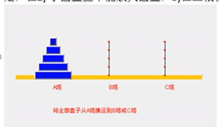
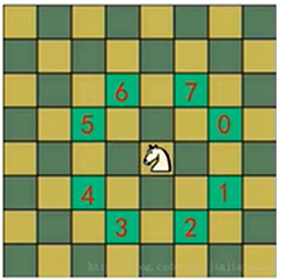
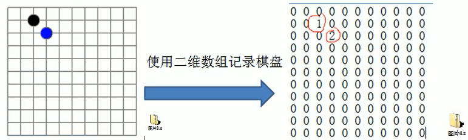
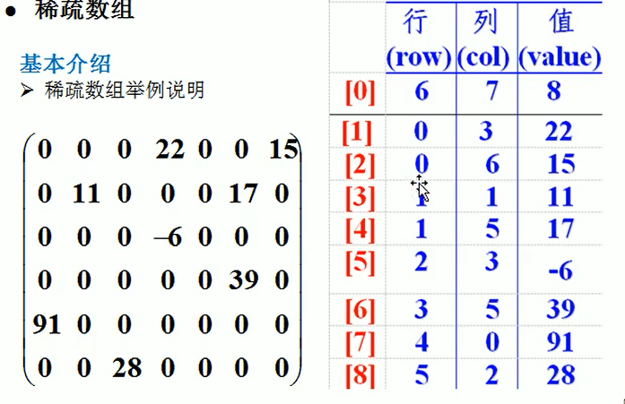
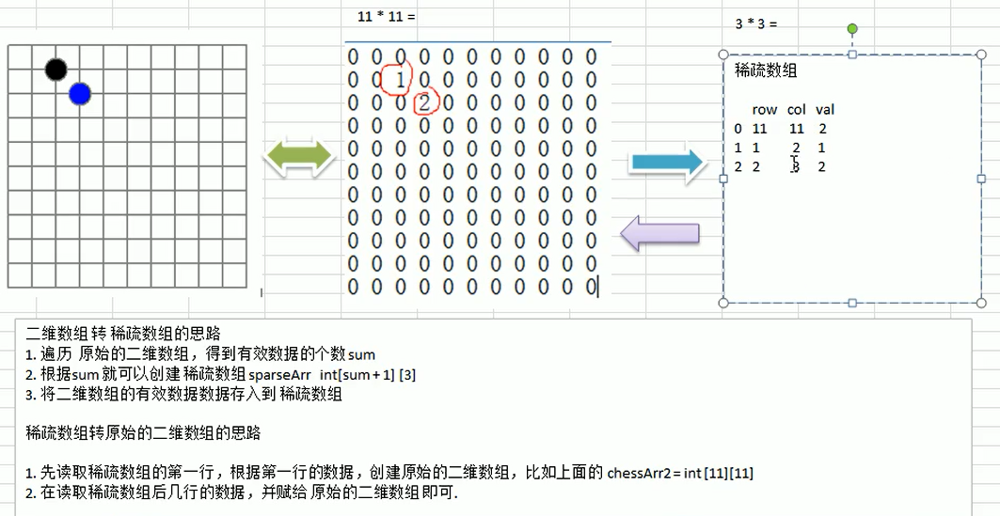

# 算法题

### 字符串匹配问题

- `条件`

  - ```markdown
    1. 有一个字符串 `str1` = "苏州科达技术有限公司"
    2. 另一个字符串 `str2` = "科达"
    3. 现在判断`str1`是否包含`str2`,如果存在,就返回第一次出现的位置,如果没有,则返回-1
    ```

- `问题`

  - ```markdown
    1. 要求用最快的速度来完成匹配
    2. 你的思路是什么?
    ```

- `解`

  - ```markdown
    - 暴力匹配 [简单,但效率低]
    - KMP算法<<部分匹配表>>
    ```

------

### 汉罗塔游戏

- `条件`

  - 

  - ```markdown
    1. 将A塔的所有圆盘移动到C塔. 并且归队在 C上
    2. 小圆盘上不能放大圆盘
    3. 在三根侄子之间一次只能移动一个圆盘
    ```

- `问题`

  - ```markdown
    1. 将A塔的所有圆盘移动到C塔. 并且归队在 C上
    ```

- `解`

  - ```markdown
    - 分治算法
    ```

------

### 八皇后问题

- `条件`

  - 

  - ```markdown
    八皇后问题,是个古老而著名的问题,是回溯算法的经典案例. 
    ```

- `问题`

  - ```markdown
    任意两个皇后不能处于同一行、同一列或统一斜线上、问有多少种摆法 `[92]`
    ```

- `解`

  - ```markdown
    - 回溯算法
    ```

------

### 马踏算法

- `条件`

  - 

  - ```markdown
    1. 马踏棋盘算法也被成为骑士周游问题
    ```

- `问题`

  - ```markdown
    1. 将马随记放在国际象棋8*8棋盘Board[0~7][0~7]的某个方格中,马按走起规则(马走日字)进行移动.要求每个方格只进入一次,走遍棋盘上全部64个方格
    ```

- `解`

  - ```markdown
    1. 深度优化遍历算法(DFS)+贪心算法优化
    ```

------

### 五子棋程序->稀疏数组问题

- `条件`
  - 


- `问题`

  - 编写的五子棋程序中,有`存盘退出`和`续上盘`的功能

- `分析问题`

  - 因为该二维数组的很多值是默认值0,因此记录了很多没有意义的数据. -> `稀疏数组`

- `基本介绍`

  - 当一个数组中大部分元素为0时, 或者为同一个值的数组时, 可以使用稀疏数组来保存该数组

- `稀疏数组的处理方法是:`

  - 

  - 记录数组一共有几行几列, 有多少个不同的值

  - 把具有不同值的元素的行列及记录在一个小规模的数组中,从而小程序的规模

  - ```markdown
    - 针对上述问题
    	- 通过稀疏数组我们可以变成 3 * 9 = 27 个数据的三维数组
    	- 二维数组 需要 6 * 7 = 42 个数据
    ```

- `应用实例`

  - 使用稀疏数组,来保留类似前面的`二维数组`(棋盘、地图等)
  - 把稀疏数组存盘, 并且可以从新恢复原来的二伟数组数
  - 整体思路分析
    - 

### 单链表的常见面试题

> **问题1： 求单链表的有效节点的个数**
>
> - `思路`
>   - 遍历++获取单链表个数
>
> **问题2： 求单链表中倒数第k个节点**
>
> - `思路`
>   - 1. 获取整个链表的有效节点的个数`size`
>     2. 遍历整个链表获取地 `size-k`即顺位的 `k`的节点
>
> **问题3： 求单链表的反转**
>
> - `思路`
>   - 1. 校验链表是否符合反转条件 -> `不能为空, 还有 1 个的情况下反转`
>     2.  定义初始指针 `cur`指向当前位置 -> `cur -> node.next`
>     3. 定义初始空指针`next`存取当前指针的对应的下一个节点 -> `next -> null`
>     4.  初始化一条新的头部数据 -> `reverseHead->new Head(0,...)`
>     5. 循环单链表，`next ->cur.next;cur.next->reverseHead.next;reverserHead.next->cur;cur->next`循环
>
> **问题4 从尾部答应单链表的数据**
>
> - `思路`
>   - 1. 可以通过翻转链表来实现,`不建议`,因为会重新生成新链表,效率低
>     2.  可以通过栈来实现此红能

### 中缀表达式

- `思路分析`
  - 先试用一个`index`来遍历我们的索引
  - 分两个栈一个`数字栈`区间,一个`符号栈`区间
  - 分扫扫描的char加入不同的栈,扫描的数字加入数字栈,扫描的是符号加入符号栈
    - 如果扫描的是符号就直接入栈
    - 如果符号栈里面有操作符,就进行比较,如果`当前的操作符的优先级小于或等于栈中的操作符`,就需要从舒展中pop出两个数,再从数栈中pop出一个符号,进行运算,将的到的结果,入数栈,然后将当前的操作符入符号栈,如果`当前的操作符的优先级大于栈中的操作符,就直接入符号栈`
  - 当表达式扫描完毕,就顺序从数栈和符号栈中pop出对应的数和符号,并运行
  - 最后数栈中只会有一个数字,就是表达式的结果

### 前缀、中缀、后缀表达式(逆波兰表达式)